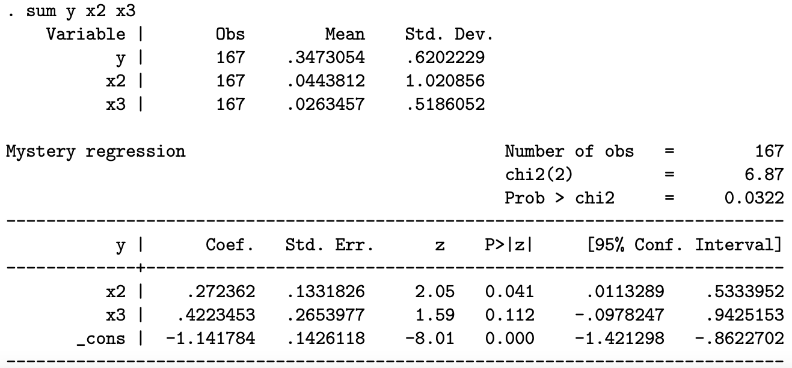

Instruções:

- Você precisa justificar suas respostas com cuidado e mostrar seu trabalho para obter o crédito total. Crédito parcial pode ser dado para cada pergunta.
- Caso o tempo se esgote ou não consiga completar a argumentação/prova formal, o crédito parcial poderá ser dado para uma resposta intuitiva.
- Salvo indicação em contrário, podem ser utilizados pressupostos padrão do modelo linear. Indique claramente as suposições que você está usando para resolver cada exercício.
- Cada questão vale 20 pontos, distribuídos igualmente entre os ítens de cada uma.

\vspace{0.25in}

1. Considere os seguintes modelos:
$$\begin{split}\mathbf{y} & =\mathbf{X\beta}_1+\mathbf{\varepsilon_1} \text{ (Modelo 1)}\\
\mathbf{y}& =\mathbf{X\beta}_2+\mathbf{Z\gamma}+\mathbf{\varepsilon}_2 \text{ (Modelo 2)}\end{split}$$ 
onde $\mathbf{X}$ é uma matrix $n\times K_X$ e $\mathbf{Z}$ é uma matrix $n\times K_Z$. Denote os estimadores de MQO de $\mathbf{b}_1$ e $\mathbf{b}_2$, respectivamente.
    a. Encontre $E[\mathbf{b}_1|\mathbf{X},\mathbf{Z}]$ e $Var[\mathbf{b}_1|\mathbf{X},\mathbf{Z}]$ caso o modelo 2 represente o verdadeiro processo gerador de        dados.
    b. Encontre $E[\mathbf{b}_2|\mathbf{X},\mathbf{Z}]$ e $Var[\mathbf{b}_2|\mathbf{X},\mathbf{Z}]$ caso o modelo 1 represente o verdadeiro processo gerador de        dados.
    c. Compare $E[\mathbf{b}_1|\mathbf{X},\mathbf{Z}]$ e $E[\mathbf{b}_2|\mathbf{X},\mathbf{Z}]$ e $Var[\mathbf{b}_1|\mathbf{X},\mathbf{Z}]$ e         $Var[\mathbf{b}_2|\mathbf{X},\mathbf{Z}]$ caso o modelo 1 represente o verdadeiro processo gerador de dados.
    d. Compare $E[\mathbf{b}_1|\mathbf{X},\mathbf{Z}]$ e $E[\mathbf{b}_2|\mathbf{X},\mathbf{Z}]$ e $Var[\mathbf{b}_1|\mathbf{X},\mathbf{Z}]$ e     $Var[\mathbf{b}_2|\mathbf{X},\mathbf{Z}]$ caso o modelo 2 represente o verdadeiro processo gerador de dados.
    e. Discuta e interprete os resultados obtidos acima.
  

2. Considere os seguintes modelos: $$\begin{split} y_i & = \beta_1 x_{1,i} + \beta_2 x_{2,i} + \beta_3 x_{3,i}+\varepsilon_i \\
y_i & = \alpha_1 z_{1,i} + \alpha_2 z_{2,i} + \alpha_3 z_{3,i}+u_i\end{split}$$  onde $z_{1,i}=x_{1,i}-2x_{2,i}$, $z_{2,i}=x_{2,i}+4x_{3,i}$, $z_{3,i}=2x_{1,i}-3x_{2,i}+5x_{3,i}$. Seja $\mathbf{X}=[\mathbf{x}_1,\mathbf{x}_2,\mathbf{x}_3]$, onde $\mathbf{x}_k=[x_{k,1},x_{k,2},\cdots,x_{k,n}]'$ (um vetor coluna) e $\mathbf{Z}=[\mathbf{z}_1,\mathbf{z}_2,\mathbf{z}_3]$, onde $\mathbf{z}_k=[z_{k,1},z_{k,2},\cdots,z_{k,n}]'$.

    a. Encontre os elementos da matrix $3\times3$ $\mathbf{A}$ tal que $\mathbf{Z}=\mathbf{XA}$.
    b. Qual a relação entre o estimador $b_1$ e os estimadores $\hat{\alpha}_1$, $\hat{\alpha}_2$ e $\hat{\alpha}_3$?
    c. Mostre que as duas regressões fornecem os mesmos valores previstos e resíduos. Forneça alguma intuição para este resultado.
  

3. Considere o modelo de regressão linear $$y_i=\mathbf{x}_i'\beta+\varepsilon_i.$$
    a. Derive a estatística de teste para a realização do seguinte teste de hipótese: $$H_0:\beta_1^2-\beta_2^2=5,  \text{ e }  \beta_2+\beta_3=1$$ $$H_1:\beta_1^2-\beta_2^2\neq5,  \text{ ou }  \beta_2+\beta_3\neq1$$
    b. Qual é a distribuição limite da sua estatística de teste?
  
4. Considere o modelo de regressão $$\mathbf{y}=\mathbf{X\beta}+\mathbf{\varepsilon}$$ onde $\mathbf{y}$ é um vetor de observações $n\times 1$, $\mathbf{X}$ é uma matrix $n\times K$, $\mathbf{\beta}$ é um vetor $K\times 1$ de coeficientes e $\mathbf{\varepsilon}$ é um vetor $n\times 1$ de termos de erro.
    a. Mostre que o estimador de MQO $\mathbf{b}$ é um estimador consistente de $\mathbf{\beta}$. Explicite todas as hipóteses e resultados utilizados em sua prova.
    b. Derive a distribuição assintótica de $\mathbf{b}$, detalhando as hipóteses e resultados necessários em sua derivação.

5. A estimativa de um modelo misterioso usando um método misterioso produz o resultado fornecido a seguir. Sabe-se que $E[y|x_2; x_3] = g( 1 + 2x_2 + 3x_3)$ onde a forma funcional $g( )$ é desconhecida, mas sabe-se que $g( )$ é monotônicamente decrescente.

    {width=70%}
    
    Forneça uma interpretação do resultado com a maior quantidade de detalhes possível.

