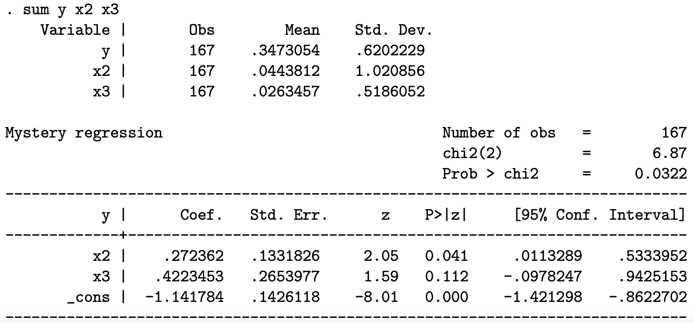

Instruções:

- Você precisa justificar suas respostas com cuidado e mostrar seu trabalho para obter o crédito total. Crédito parcial pode ser dado para cada pergunta.
- Caso o tempo se esgote ou não consiga completar a argumentação/prova formal, o crédito parcial poderá ser dado para uma resposta intuitiva.
- Indique claramente as suposições que você está usando para resolver cada exercício.

\vspace{0.25in}

1. Considere o seguinte modelo: $$\mathbf{y}= \mathbf{X}_1\pmb{\beta}_1+\mathbf{X}_2\pmb{\beta}_2+\pmb{\varepsilon}$$, onde $\mathbf{X}_1$ é uma matrix de $K_1$ variáveis e  $\mathbf{X}_2$ é uma matrix de $K_2$ variáveis e $K_1 + K_2 = K$. Sejam $\mathbf{b}_1$ e $\mathbf{b}_1$ os estimadores de mínimos quadrados ordinários (MQO) de $\pmb{\beta}_1$ e $\pmb{\beta}_2$, respectivamente.

    a. Derive a expressão para o estimador $\mathbf{b}_1$ como função de $\mathbf{y}$, $\mathbf{X}_1$, $\mathbf{X}_2$ e $\mathbf{b}_2$ usando o modelo de regressão particionada.
    b. Derive a expressão para o estimador $\mathbf{b}_2$ como função de $\mathbf{y}$, $\mathbf{X}_1$, $\mathbf{X}_2$, e $\mathbf{M}_1$ usando o modelo de regressão particionada, onde $\mathbf{M}_1 = \mathbf{I} - \mathbf{X}(\mathbf{X'X})^{-1}\mathbf{X}'$.
    c. Suponha que apenas observamos $\mathbf{X}_1$, mas nāo $\mathbf{X}_2$. Portanto, estimamos o modelo $\mathbf{y} =  \mathbf{X}_1\pmb{\beta}_1+\pmb{\varepsilon}$. Derive a expressão para o estimador de MQO $\mathbf{b}_1$ sob tais condições (ou seja, o estimador usual de MQO $\mathbf{b}_1$ quando regredimos $\mathbf{y}$ em $\mathbf{X}_1$).
    d. Sendo $\mathbf{y}= \mathbf{X}_1\pmb{\beta}_1+\mathbf{X}_2\pmb{\beta}_2+\pmb{\varepsilon}$ o modelo verdadeiro, encontre uma expressão para o viés de $\mathbf{b}_1$ encontrado acima. Sob quais condições o viés encontrado é igual a zero?
    
  

2. Considere o seguinte modelo de regressão linear: $$\mathbf{y} = \mathbf{X}\pmb{\beta}+\pmb{\varepsilon},$$  onde $\mathbf{y}$ e $\pmb{\varepsilon}$ são vetores $n \times 1$, $\pmb{\beta}$ é um vetor $K \times 1$ e $\mathbf{X}$ é uma matrix $n \times K$ ($n$ denota o tamanho da amostra). Assuma $\pmb{\varepsilon}|\mathbf{X} \sim N(\mathbf{0},\sigma^2\mathbf{I}_n)$, $\sigma^2>0$. Os resíduos são dados por $\mathbf{e}=\mathbf{y}-\mathbf{Xb}$, onde $\mathbf{b}=(\mathbf{X'X})^{-1}\mathbf{X'y}$.

    a. Mostre que $E(s^2)= \sigma^2$, onde $s^2 = \mathbf{e'e}/(n-K)$.
    b. Suponha que estamos interessados na distribuição assintótica de um conjunto de $J$ funções continuamente diferenciáveis $\mathbf{f}(\mathbf{b})$. Descreva como podemos obter esta distribuição assintótica e como estimar os parâmetros na prática.

\clearpage

3. Considere o modelo de regressão $$\mathbf{y}=\pmb{X\beta}+\pmb{\varepsilon}$$ $$\mathbf{z} = \mathbf{y} + \pmb{\eta}$$ onde $\mathbf{y}$ é um vetor de observações $n\times 1$, $\mathbf{X}$ é uma matrix $n\times K$, $\pmb{\beta}$ é um vetor $K\times 1$ de coeficientes, $\pmb{\varepsilon}$ e $\pmb{\eta}$ são vetores $n\times 1$ de termos de erro. Considere uma amostra de tamanho $n$. Suponha $E(x_i\varepsilon_i)=0$, $E(y_i\eta_i)=0$ e $E(x_i\eta_i)=0$. Suponha adicionalmente que $E(\pmb{\varepsilon}\pmb{\varepsilon}'|\mathbf{X})=\sigma^2\mathbf{I}$, $E(\pmb{\eta}\pmb{\eta}'|\mathbf{X})=\lambda^2\mathbf{I}$, sendo $\sigma^2>0$ e $\lambda^2>0$ constantes. Ademais, suponha que estimamos $\pmb{\beta}$ regredindo $\mathbf{z}$ em $\mathbf{X}$. Denote o estimador por $\tilde{\pmb{\beta}}$.

    a. $\tilde{\pmb{\beta}}$ é um estimador não-viesado de $\pmb{\beta}$? Caso seja, prove. Caso contrário, indique as condições adicionais que você precisa para não-viés e prove o resultado nessas condições.
    b. $\tilde{\pmb{\beta}}$ é um estimador consistente de $\pmb{\beta}$? Caso seja, prove. Caso contrário, indique as condições adicionais que você precisa para consistência e prove o resultado nessas condições.
    c. $\tilde{\pmb{\beta}}$ é um estimador eficiente? Dica: compare $Var[\tilde{\pmb{\beta}}|\mathbf{X}]$ com $Var[\mathbf{b}|\mathbf{X}]$, onde $\mathbf{b}=(\mathbf{X'X})^{-1}\mathbf{X'y}$.  
    d. Encontre a distribuição assintótica de $\sqrt{n}(\tilde{\pmb{\beta}}-\pmb{\beta})$ quando $n\rightarrow \infty$. Indique quaisquer condições adicionais necessárias.

5. A estimativa de um modelo misterioso usando um método misterioso produz o resultado fornecido a seguir. Sabe-se que $E[y|x_2; x_3] = g( 1 + 2x_2 + 3x_3)$ onde a forma funcional $g( )$ é desconhecida, mas sabe-se que $g( )$ é monotônicamente decrescente.

    {width=70%}
    
    Forneça uma interpretação do resultado com a maior quantidade de detalhes possível.

