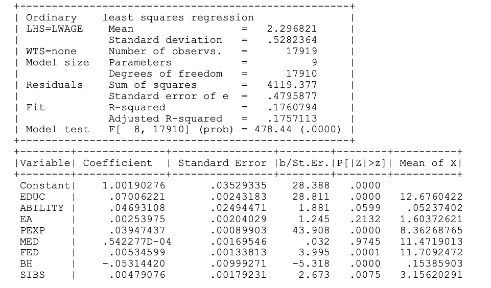

Instruções:

- Você precisa justificar suas respostas com cuidado e mostrar seu trabalho para obter o crédito total. Crédito parcial pode ser dado para cada pergunta.
- Caso o tempo se esgote ou não consiga completar a argumentação/prova formal, crédito parcial poderá ser dado para uma resposta intuitiva.
- Salvo indicação em contrário, podem ser utilizados pressupostos padrão do modelo linear. Indique claramente as suposições que você está usando para resolver cada exercício.
- Cada item dentro de cada questāo vale 1 ponto, enquanto que a última questāo vale 2 pontos.

\vspace{0.25in}

1. Suponha que o modelo de regressão linear $\mathbf{y} = \mathbf{X}\pmb{\beta}+\pmb{\varepsilon}$, com $E(\varepsilon_i|\mathbf{x}_i)=0$ satisfaz a restrição $$\mathbf{R}\pmb{\beta}=\mathbf{0}$$ onde $\mathbf{R}$ é uma matriz $J \times K$, com $J<K$. Considere o seguinte estimador para $\pmb{\beta}$: $$\pmb{\tilde{\beta}}=\mathbf{b}- (\mathbf{X'X})^{-1}\mathbf{R}'[\mathbf{R}(\mathbf{X'X})^{-1}\mathbf{R}']^{-1}\mathbf{Rb}$$ onde $\mathbf{b}$ é o estimador de MQO, o qual satisfaz todas as hipóteses clássicas do modelo de regressão linear.

    a. Mostre que $\mathbf{R}\pmb{\tilde{\beta}} = \mathbf{0}$
    b. Encontre $E(\pmb{\tilde{\beta}}|\mathbf{X})$
    c. Encontre $Var(\pmb{\tilde{\beta}}|\mathbf{X})$. (Dica: Encontre $\pmb{\tilde{\beta}}$ como uma função linear de $\mathbf{b}$ primeiro.)

\vspace{0.25in}

2. Considere o seguinte modelo de regressão linear $$ \begin{split}ln wage = & \beta_1 + \beta_2 Educ + \beta_3 Ability + \beta_4 Educ \times Ability + \beta_5 Experience  \\
 & + \beta_6 Mother's\text{ } education + \beta_7 Father's\text{ } education + \beta_8 Broken\text{ } home \\
 &  + \beta_9 Siblings + \varepsilon \end{split}$$ onde $Wage$ mede salário, $Educ$ captura anos de educaçāo, $Ability$ é uma proxy para habilidade, $Experience$ mede anos de experiência no mercado de trabalho, $Mother's\text{ } education$ e $Father's\text{ } education$ sāo medidas de escolaridade dos pais. Finalmente, $Broken\text{ } home$ é uma variável dummy para residência em um lar desfeito, enquanto que  $Siblings$ mede o número de irmãos e irmãs. Com estes dados, Koop e Tobias (2004, JAE) estudam a relação entre salários e educação, capacidade e características familiares. A tabela abaixo reporta o resultado da estimação deste modelo por MQO:

{ width=80% style="display: block; margin: 0 auto" }

  a. Forneça os efeitos parciais estimados para as variáveis $Broken\text{ } home$ ($BH$ na tabela) e $Educ$. Considere um indivíduo com o nível de habilidade média dos dados.
  b. Encontre uma estatística de teste e encontre sua distribuiçāo para as seguintes restrições: $\beta_4 =  0$ e $\beta_6 =  \beta_7$. Explique como proceder para a realização deste teste. Forneça o maior número de detalhes possível em sua resposta.

\vspace{0.25in}

3. Considere a seguinte equação de variáveis instrumentais abaixo $$\mathbf{y} = \mathbf{X}_1\pmb{\beta}_1 + \mathbf{X}_2\pmb{\beta}_2 + \pmb{\varepsilon}$$ onde $\mathbf{X}_1$ é uma matriz $K_1 \times n$, $\mathbf{X_2}$ é uma matriz $K_2 \times n$, $\mathbf{Z}$ é uma matriz $L \times n$, $L \geq K_1 + K_2$. Assuma que $E(\mathbf{z}_i \varepsilon_i) = 0$, $\text{plim} \frac{\mathbf{Z'Z}}{n}= \mathbf{Q}_{zz}$ e $\text{plim} \frac{\mathbf{Z'X}}{n}= \mathbf{Q}_{zx}$ 

    Considere o estimador de 2SLS $\mathbf{b}_{1,2SLS}$ de $\pmb{\beta}$ obtido através da regressāo de IV mal-especificada de $\mathbf{y}$ em $\mathbf{X}_1$ somente, usando $\mathbf{Z}$ como instrumento para $\mathbf{X}_1$.

    a. Encontre uma expressāo para $\mathbf{b}_{1,2SLS}$ na forma $\mathbf{b}_{1,2SLS}=\pmb{\beta}_1 + \mathbf{b}_{1n} + \mathbf{r}_{1n}$, onde $\mathbf{b}_{1n}$ depende de $\mathbf{X}_1$, $\mathbf{X}_2$, $\mathbf{z}$ e $\pmb{\beta_2}$ e $\mathbf{r}_{1n}$ depende de $\mathbf{X}_1$, $\mathbf{X}_2$ e $\pmb{\varepsilon}$.
    b. Encontre $\text{plim } \mathbf{b}_{1,2SLS}$. (Dica: Podemos escrever $Q_{zx} = [Q_{z1} Q_{z2}]$, o qual possui posto cheio. Portanto, tanto $Q_{z1}$ quanto $Q_{z2}$ possuem posto cheio.)
    c. Encontre a distribuição assintótica de $\sqrt{n}(\mathbf{b}_{1,2SLS}-\pmb{\beta}_1-\mathbf{b}_{1n})$ quando $n \rightarrow \infty$.
    
\vspace{0.25in}
    
4. Considere o modelo $$y_i = \alpha + \beta x_i + \varepsilon_i,$$ onde $Cov[x_i, \varepsilon_i] = \gamma \neq 0$. Seja $z$ um instrumento relevante e exógeno para este modelo. Assuma também que $z$ é binário, ou seja, assume somente os valores 1 e 0. 

    a. Derive a forma algébrica para o estimador de variável instrumental, $b_{IV}$, para $\beta$ na formulação do tipo Wald (ou seja, uma razão de diferenças de médias).
    b. Como interpretamos $b_{IV}$ caso $x$ também seja binário (por exemplo, $x$ representa participação em um determinado tratamento)? Quais pressupostos adicionais sobre $z$ devem ser satisfeitos para esta interpretação ser válida?
    
5. Grande parte das escolas particulares nos EUA são administradas por organizações religiosas. Economistas e educadores há muito tempo discutem sobre os méritos relativos das escolas paroquiais e das escolas públicas tradicionais. Evans
e Schwab (1995; QJE) estimam os efeitos de frequentar uma escola secundária católica sobre a probabilidade de concluir o ensino médio e frequentar a faculdade.
Seja $COLL_i$ uma dummy indicando frequência universitária e seja $CHS_i$ indicador de ensino médio católico. Um modelo de probabilidade linear para os efeitos da escola católica na frequência à faculdade é dado por $$COLL_i = \beta_0 + \beta_1 CHS_i + \mathbf{X}_i'\pmb{\beta}_2 + \varepsilon_i$$ onde os controles, $\mathbf{X}_i$ incluem variáveis como gênero, raça, renda familiar e escolaridade dos pais. Evans e Schwab calculam estimativas 2SLS deste modelo usando uma dummy para ser católico como instrumento para $CHS_i$. Denote o instrumento católico por $Z_i$. Descreva e analise com a maior quantidade de detalhes possível os passos para esta estimação, bem como a interpretação do coeficiente estimado e as hipóteses necessárias para tal. Discuta a validade desta estratégia de identificação do efeito causal. Sua nota nesta esta questão dependerá do nível de detalhes e formalização da sua exposição apresentados. 