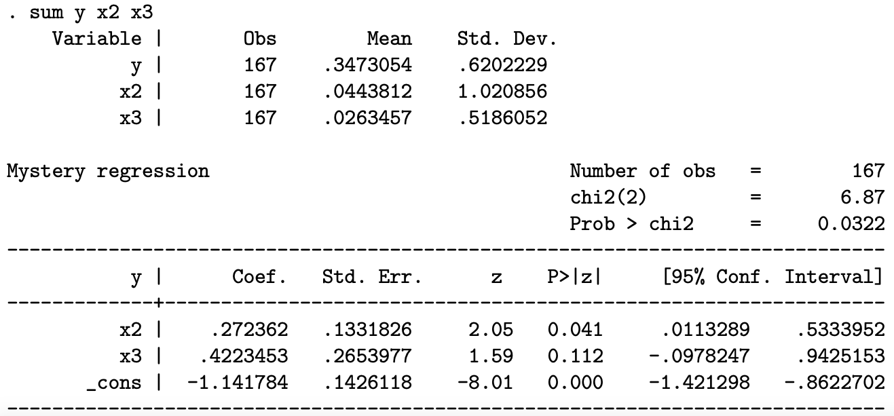

Instruções:

- Você precisa justificar suas respostas com cuidado e mostrar seu trabalho para obter o crédito total. Crédito parcial pode ser dado para cada pergunta.
- Caso o tempo se esgote ou não consiga completar a argumentação/prova formal, o crédito parcial poderá ser dado para uma resposta intuitiva.
- Salvo indicação em contrário, podem ser utilizados pressupostos padrão do modelo linear. Indique claramente as suposições que você está usando para resolver cada exercício.
- Cada questão vale 20 pontos, distribuídos igualmente entre os ítens de cada uma.

\vspace{0.25in}

1. Considere o seguinte modelo de regressão linear clássico particionado: $$\mathbf{y}=\mathbf{X_1\beta_1}+\mathbf{X_2\beta_2}+\varepsilon,$$ onde $\mathbf{y}$ é um vetor $n \times 1$ de observações sobre a variável dependente, e $\mathbf{X}_1$ e $\mathbf{X}_2$ são matrizes de observações $n \times K_1$ e $n \times K_2$ nos regressores. Ademais, definimos $\mathbf{X}=[\mathbf{X}_1 \text{  }  \mathbf{X}_2]$ como uma matriz $n\times K$, onde $K=K_1 + K_2$.
      a. Mostre que ao omitirmos as variáveis incluídas em $\mathbf{X}_2$ e estimarmos $\mathbf{\beta_1}$ executando uma regressão de $\mathbf{y}$ apenas em $\mathbf{X}_1$, o estimador de OLS $\mathbf{b}_1$ geralmente será viesado com o viés dado por $\mathbf{P}_{12}\beta_2$, onde $\mathbf{P}_{12}=(\mathbf{X_1'X_1})^{-1}\mathbf{X_1'X_2}$.
      b. Interprete os elementos da matriz $\mathbf{P}_{12}$. Sob quais condições $\mathbf{b}_1$ será não-viesado?
      c. Um pesquisador está estimando a equação de demanda por móveis usando dados em cross-section. Como regressores ela usa um termo de intercepto, o preço relativo dos móveis, e omite a variável renda, a qual é relevante para o modelo. Encontre uma expressão para o viés da estimativa de OLS da variável preço nesta regressão; discuta seu sinal.
    
2. Suponha duas amostras independentes $(\mathbf{y}_1, \mathbf{X}_1)$ e $(\mathbf{y}_2, \mathbf{X}_2)$ que satisfazem $\mathbf{y}_1 = \mathbf{X}_1\beta_1+\varepsilon_1$ e $\mathbf{y}_2 = \mathbf{X}_2\beta_2+\varepsilon_2$ onde $E(\mathbf{X}_{1i}\varepsilon_{1i}) = 0$ e $E(\mathbf{X}_{1i}\varepsilon_{1i}) = 0$ e tanto $\mathbf{X}_1$ quanto $\mathbf{X}_2$ têm $K$ colunas. Sejam $\mathbf{b}_1$ e $\mathbf{b}_2$ os estimadores de OLS de $\mathbf{\beta}_1$ e $\mathbf{\beta}_2$, respectivamente. Para simplificar, você pode assumir que ambas amostras possuem o mesmo número de observações $n$.
    a. Encontre a distribuição assintótica de $$\sqrt{v}[(\mathbf{b}_1 - \mathbf{b}_2)-(\mathbf{\beta}_1 - \mathbf{\beta}_2)]$$ quando $n\rightarrow\infty$.
    b. Encontre a estatística de teste apropriada para $H_0: \mathbf{\beta}_1=\mathbf{\beta}_2$
    c. Encontre a distribuição assintótica desta estatística sob $H_0$.
  

3. Prove que o estimador de mínimos quadrados no modelo de regressão clássico é o estimador linear não-viesado de variância mínima.

4. Considere o modelo de regressão $$\mathbf{y}=\mathbf{X\beta}+\mathbf{\varepsilon}$$ onde $\mathbf{y}$ é um vetor de observações $n\times 1$, $\mathbf{X}$ é uma matrix $n\times K$, $\mathbf{\beta}$ é um vetor $K\times 1$ de coeficientes e $\mathbf{\varepsilon}$ é um vetor $n\times 1$ de termos de erro.
    a. Mostre que o estimador de MQO $\mathbf{b}$ é um estimador consistente de $\mathbf{\beta}$. Explicite todas as hipóteses e resultados utilizados em sua prova.
    b. Derive a distribuição assintótica de $\mathbf{b}$, detalhando as hipóteses e resultados necessários em sua derivação.

5. A estimativa de um modelo misterioso usando um método misterioso produz o resultado fornecido a seguir. Sabe-se que $E[y|x_2; x_3] = g( 1 + 2x_2 + 3x_3)$ onde a forma funcional $g( )$ é desconhecida, mas sabe-se que $g( )$ é monotônicamente decrescente.

    {width=70%}
    
    Forneça uma interpretação do resultado com a maior quantidade de detalhes possível.

