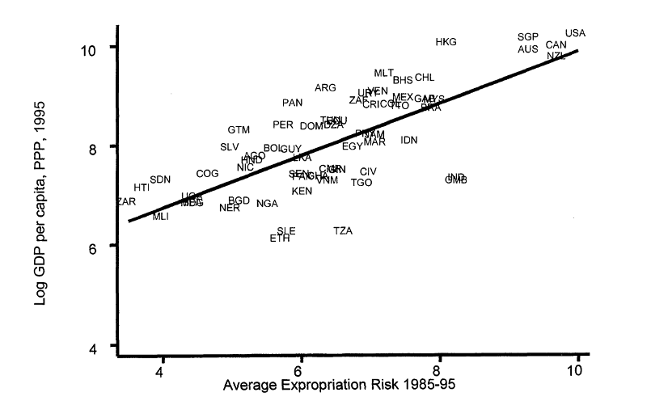
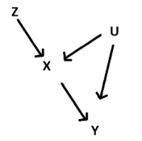
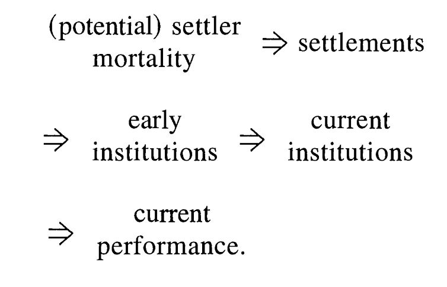
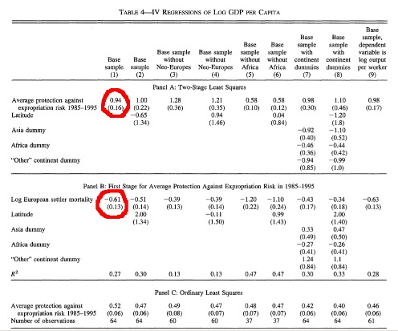
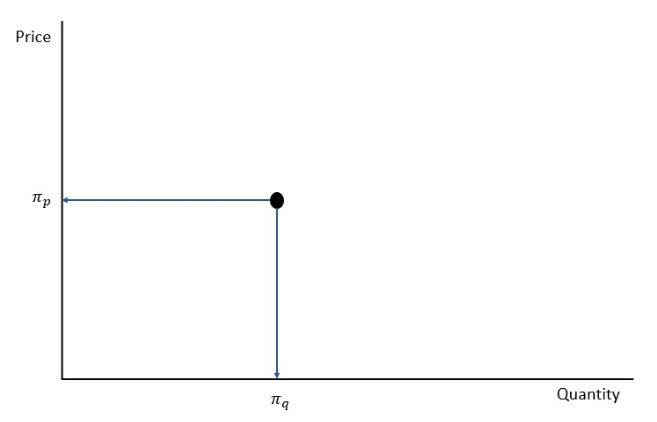
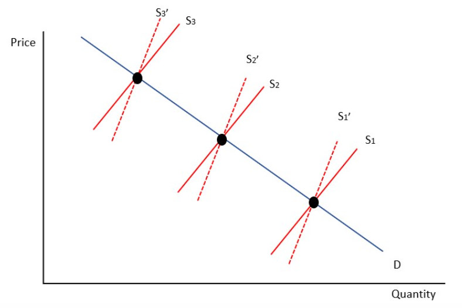
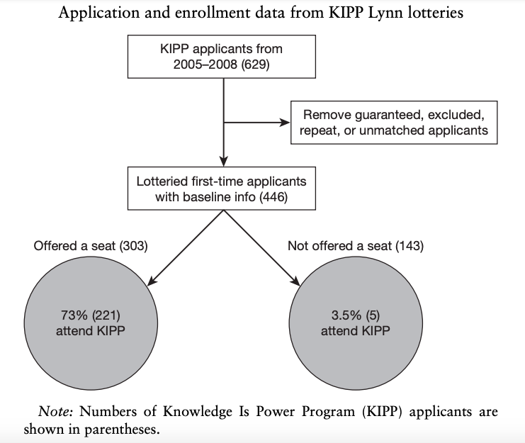
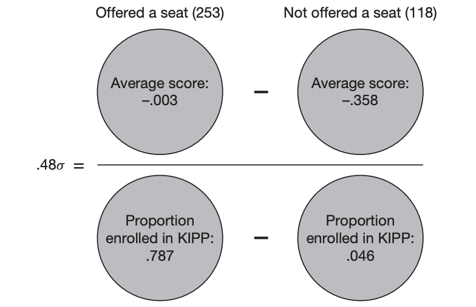
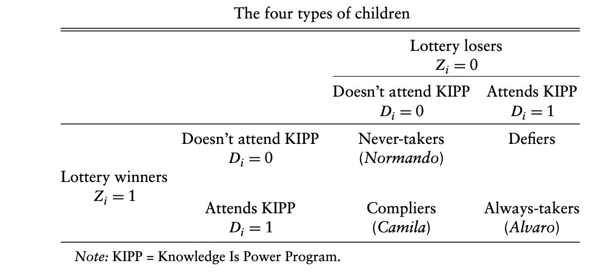

# Econometrics

## Intro

In many applications the exogeneity assumption ($E(\mathbf{\varepsilon}|\mathbf{X})=0$) might not be valid.

\vfill

In this lecture, we will discuss an estimation method that arises in situations like those.

\vfill

Recall: Least squares estimator loses its appeal since it is no longer **unbiased** and **consistent**.

\vfill

Throughout the analysis, we will consider a partition of the matrix $\mathbf{X}$ into two sets of variables, $\mathbf{x}_1$ and $\mathbf{x}_2$, with the assumption that $\mathbf{x}_1$ is not correlated with $\mathbf{\varepsilon}$, but $\mathbf{x}_2$ might be.

\vfill

### How does Endogeneity arise?

In which empirical situations should we suspect of violations of assumption **A.3**?

\vfill

Below is a (non-exhaustible) list :

  1. Omitted variables
  2. Endogenous treatment effect
  3. Simultaneous equations
  4. Measurement error
  5. Nonrandom sampling

      - Survivorship bias
      - Attrition bias
    
\vfill

Here, we will discuss **one** way to deal with such issues.

\vfill

### The Beginning

The earliest application involved attempts to estimate demand and supply curves for products.

\vfill

A simple but difficult question: How to find demand or supply curves?
  
  - Difficulty: we can only observe intersections of supply and demand, yielding equilibrium price and quantity pairs

\vfill

Solution: Wright (1928) uses variables that appear in one equation to shift this curve and trace out the other.

\vfill

The variables that do the shifting came to be known as **Instrumental Variables**.

\vfill

## Assumptions of the Extended Model

We maintain most of the assumptions from before, including $$\text{plim }(\mathbf{X'X}/n)=Q_{\mathbf{xx}}$$

\vfill

However, we replace **A.3** with **A.I3**: $E[\varepsilon_i|\mathbf{x}_i]=\mathbf{\eta}$.

\vfill

This means that the regressors now provide some information about the expectations of the disturbances.

\vfill

### Assumptions of the Extended Model

Assumption **A.I3** implies that $$E[\mathbf{x}_i \varepsilon_i]=\gamma$$

for some nonzero $\gamma$.

We'll make use of Khinchine's Weak Law of Large Numbers:

\vfill

\vfill

### Assumptions of the Extended Model

Therefore, if the data is well-behaved, we have $$\text{plim }\frac{1}{n}\mathbf{X'\varepsilon}=\gamma$$

\vfill

Note that we are back to the original model if $\mathbf{\eta}=0$.

\vfill

Assumption **A.6** is no longer relevant here -- all results will be based on asymptotics.

\vfill

### Assumptions of the Extended Model

We now make an assumption that there is an additional set of variables, $\mathbf{z}=(z_1,\cdots,z_L)$, that have two essential properties:

  1. **Relevance**: They are correlated with the independent variables, $\mathbf{X}$.
  2. **Exogeneity**: They are uncorrelated with the disturbance.
  
In the context of our model, variables that have these two properties are **Instrumental Variables**.

\vfill

Intuitively, we want to split $\mathbf{x}_{1k}$ into two parts:

  1. part that is correlated with the error term
  2. part that is uncorrelated with the error term
  
\vfill

By using $\mathbf{z}$, we can isolate the variation in $\mathbf{x}_{1k}$ that is uncorrelated with $\mathbf{\varepsilon}$, then we can use this part to obtain a consistent estimate of $\mathbf{\beta}$.

\vfill

### Assumptions of the Extended Model

Using the same analysis as in the large sample properties of the OLS discussion, we have:

  - $\text{plim }(1/n)\mathbf{Z'Z}=\mathbf{Q}_{\mathbf{zz}}$, a finite, positive definite matrix (well-behaved data)
  - $\text{plim }(1/n)\mathbf{Z'X}=\mathbf{Q}_{\mathbf{zx}}$, a finite, $L\times K$ matrix with rank $K$ (relevance)
  - $\text{plim }(1/n)\mathbf{Z'\pmb{\varepsilon}}=0$ (exogeneity)
  
\vfill

### Assumptions of the Extended Model

For the present, we will assume that $L=K$.

\vfill

The $K_1$ variables in $\mathbf{x}_1$ are $K_1$ of the  variables in $\mathbf{Z}$ and the $K_2$ remaining variables are the other **exogenous** variables that are not the same as $\mathbf{x}_2$.

\vfill

That is:

  - $\mathbf{z}_2$ are instruments for $\mathbf{x}_2$
  - $\mathbf{x}_1$ are instruments for themselves.
  
\vfill

## Instrumental Variables Estimation

The LS estimator is no longer unbiased (can you show the expression for the bias?), so the Gauss-Markov theorem no longer holds.

\vfill

The estimator is also inconsistent!

\vfill

**Note**: The inconsistency of the LS is not confined to the coefficients on the endogenous variables. All elements of $\mathbf{b}$ are inconsistent!

\vfill

### The IV Estimator

Because $E[\mathbf{z}_i\varepsilon_i]=0$ and all terms have finite variances, it follows that $\text{plim }\left(\frac{\mathbf{Z'\varepsilon}}{n}\right)=0$ (why?) 

\vfill

Therefore, $$\text{plim }\left(\frac{\mathbf{Z'y}}{n}\right)=\left[\text{plim }\left(\frac{\mathbf{Z'X}}{n}\right)\right]\mathbf{\beta}$$

\vfill

Since $L=K$, $\mathbf{Z'X}$ is a square matrix. It follows that

$$\left[\text{plim }\left(\frac{\mathbf{Z'X}}{n}\right)\right]^{-1}\text{plim }\left(\frac{\mathbf{Z'y}}{n}\right)=\pmb{\beta}$$

which leads to the IV estimator

$$\mathbf{b}_{IV}=(\mathbf{Z'X})^{-1}\mathbf{Z'y}$$

\vfill

### The IV Estimator

For a model with a constant term and a single $x$ and instrumental variable $z$, we have

$$b_{IV}=\frac{\sum_{i=1}^n{(z_i-\bar{z})(y_i-\bar{y})}}{\sum_{i=1}^n{(z_i-\bar{z})(x_i-\bar{x})}}=\frac{Cov(z,y)}{Cov(z,x)}$$

\vfill

### Asymptotic Distribution of the IV Estimator

We have seen that $\mathbf{b}_{IV}$ is consistent. Let's now turn to its asymptotic distribution.

\vfill

First, write

$$\sqrt{n}(\mathbf{b}_{IV}-\pmb{\beta})=\left(\frac{\mathbf{Z'X}}{n}\right)^{-1}\frac{1}{\sqrt{n}}\mathbf{Z'}\pmb{\varepsilon}$$

which has the same limiting distribution as $$\mathbf{Q}_{\mathbf{zx}}^{-1}[(1/\sqrt{n})\mathbf{Z'\varepsilon}]$$

\vfill

### Asymptotic Distribution of the IV Estimator

We can apply the same principles we used for $\frac{1}{\sqrt{n}}\mathbf{X'\varepsilon}$ to show

$$\frac{1}{\sqrt{n}}\mathbf{Z}'\mathbf{\varepsilon}\xrightarrow{d}N[\mathbf{0},\sigma^2\mathbf{Q}_{\mathbf{zz}}]$$ and

$$\left(\frac{\mathbf{Z'X}}{n}\right)^{-1}\frac{1}{\sqrt{n}}\mathbf{Z'}\pmb{\varepsilon}\xrightarrow{d}N[\mathbf{0},\sigma^2\mathbf{Q}_{\mathbf{zx}}^{-1}\mathbf{Q}_{\mathbf{zz}}\mathbf{Q}_{\mathbf{xz}}^{-1}]$$

\vfill

### Estimating the Asymptotic Covariance Matrix

To estimate the asymptotic covariance matrix, we require an estimator of $\sigma^2$.

\vfill

The natural estimator is

$$\hat{\sigma}^2=\frac{1}{n-K}\sum_{i=1}^n{(y_i-\mathbf{x}_i'\mathbf{b}_{IV})^2}$$

\vfill

We estimate $Asy.Var[\mathbf{b}_{IV}]$ with

$$Est.Asy.Var[\mathbf{b}_{IV}]=\hat{\sigma}^2(\mathbf{Z'X})^{-1}(\mathbf{Z'Z})(\mathbf{X'Z})^{-1}$$

### Motivating the IV Estimator

In obtaining the IV estimator, we relied on the solutions to

$$\text{plim } (\mathbf{Z'y}/n) = \text{plim }(\mathbf{Z'X}/n)\pmb{\beta} \text{ or } \mathbf{Q}_{\mathbf{zy}}= \mathbf{Q}_{\mathbf{zx}}\pmb{\beta}$$

\vfill

This is a set of $K$ equations and $K$ unknowns. If $\mathbf{Q}_{\mathbf{zx}}^{-1}$ exists, we have a unique solution.

\vfill

The corresponding moment equations if only $\mathbf{X}$ is used would be

$$\begin{split}\text{plim } (\mathbf{X'y}/n) = & \text{plim }(\mathbf{X'X}/n)\mathbf{\beta} + \text{plim }(\mathbf{X'\varepsilon}/n)\\
 = & \text{plim }(\mathbf{X'X}/n)\mathbf{\beta} + \mathbf{\gamma}\end{split}$$

or

$$\mathbf{Q}_{\mathbf{xy}}=\mathbf{Q}_{\mathbf{xx}}\pmb{\beta}+\pmb{\gamma}$$

\vfill

which is a system of $K$ equations and $2K$ unknowns.

\vfill

The implication is that $\mathbf{\beta}$ is not **identified** in terms of the moments of $\mathbf{X}$ and $\mathbf{y}$ alone.

\vfill

### Motivating the IV Estimator

Consider the most common application of IV, where there is a single endogenous variable in a multiple regression model:

$$y_i=x_{1i}\beta_1+x_{2i}\beta_2+\cdots+x_{Ki}\beta_K$$ with $cov(x_k,\mathbf{\varepsilon})\neq 0$.

\vfill

The IV estimator, based on instrument $\mathbf{z}$, proceeds from two conditions:

  1. **Relevance**: $cov(\mathbf{z},\mathbf{x}_k|\mathbf{x}_1,\cdots,\mathbf{x}_{K-1})\neq \mathbf{0}$
  2. **Exogeneity**: $E({\varepsilon|z})=0$
  
\vfill

### Motivating the IV Estimator

The relevance condition requires that the instrument provides explanatory power of the variation of the endogenous beyond that provided by the other exogenous variables already in the model.

\vfill

That is, in the regression

$$\mathbf{x}_k=\theta_1\mathbf{x}_1+\theta_2\mathbf{x}_2+\cdots+\theta_{K-1}\mathbf{x}_{K-1}+\delta\mathbf{z}+\mathbf{u},$$

the relevance condition can be verified by conducting a simple significance test on the coefficient $\delta$.

\vfill

The exogeneity condition cannot be directly tested.

\vfill

### An Example: Acemoglu, Johnson, and Robinson (2001)

Acemoglu, Johnson, and Robinson (2001) empirically address the question of how important institutions are for economic development.

\vfill

There is a positive correlation between institutions and economic progress.

### Institutions and Progress

### Institutions and Progress

Estimated regression:
 $$\log(\text{GDP per capita})=\alpha+\gamma\text{Institutions}+\mathbf{X}\beta+\varepsilon$$
 
Least squares estimation of this relationship is likely to violate the exogeneity assumption!

\vfill

Issues:

  1. Reverse causality
  2. Omitted variables
  3. Measurement error
  
\vfill

Therefore OLS coefficients will be biased and inconsistent!

\vfill

### AJR (2001)

We would need to find a variable $z$, an "instrument", satisfying the following conditions:

  1. relevance: $z$ is correlated with $Institutions$;

  2. exogeneity: $z$ is uncorrelated with $\varepsilon$
  
\vfill

If $z$ satisfies these conditions, then we call it a valid instrument.

\vfill

### Graphical Representation

### AJR (2001)

So, how do AJR employ an IV strategy to estimate the causal effect of institutions on economic performance?

\vfill

They focus their analysis on former European colonies and explore their colonization as a **natural experiment**.

\vfill

Main argument:

  - More tropical disease $\Rightarrow$
  - Less European residential settlement $\Rightarrow$
  - Worse government institutions (e.g. less rule of law, more resource “extraction”) $\Rightarrow$ Slower long-run economic growth

### Main Argument

### What makes Institutions “extractive”?

The primary role of colonies is to provide resources to the host nation: 

  - Natural resources (e.g. lumber, coal, oil)
  - Finished goods (e.g. furniture, cotton cloth) 
  - Labor (e.g. military services, slaves)

\vfill

In many cases, this one-way relationship can lead to policies that sacrifice the long-term growth of the colony in favor of growth for the host country 

\vfill

### Extractive Institutions

1. Military administration of the colony 
2. Indirect rule through local leaders, with no real power
    - Also, no development of robust local governance 
3. Investment in a select amount of infrastructure for resource extraction 
    - Development only of the mines, port, and railroad between them 
4. Impressment of local population into forced labor
5. No political participation or rights for local population 
6. Culture of extracting as much benefit as possible from local population

### Inclusive Institutions

Contrast this with the institutions for permanent settlement colonies: 

  - European settlers retained rights of citizenship 
  - Well developed legal system and local governance 
  - Strong property rights 
  - Exemptions from certain extractive taxes and policies 
  - Development of higher education institutions 
  - Free movement of elites (and their rights) between colony and host

### Types of Colonial Settlements

In places with similar geography/climate to the host country, Europeans founded permanent settlements with strong institutions 
  - Examples: USA, Canada, Australia, Argentina, Uruguay 

\vfill

In areas with high mortality for Europeans, they didn’t bother with permanent settlements, and set up extractive frameworks instead
  - Examples: Nigeria, Liberia, Andes (Peru, Bolivia), Caribbean 

\vfill

Some area had both types of institutions 
  - Examples: Apartheid South Africa, Jim Crow Southern USA

\vfill

### AJR (2001)
This story, if correct, allows for the use of Instrumental variables.

\vfill

Instrument they use: European settler mortality rate

\vfill

  - Instrument Relevance: In areas with high settler mortality in the 1700s, Europeans developed extractive institutions for those colonies 

\vfill

  - Instrument Exogeneity: Since the settler mortality rate occurred over 200 years ago, not contemporary with any current economic performance, except through the present-day institutions 
  
\vfill

### AJR (2001)

### Testing the IV Assumptions

How can we know whether an instrument $z$ is valid?

\vfill

Recall assumptions:

  - Instrument Relevance (aka inclusion restriction)
  - Instrument Exogeneity (aka exclusion restriction)
  
The first assumption can easily be tested.

  - First stage $F$-test tell us how strong the association between instrument and endogenous variable is.
  - Rule-of-thumb: instrument is valid if $F\geq 10$ (maybe more).

\vfill

### Testing the IV Assumptions

How about the second assumption?
  - This is a lot more difficult!
  
\vfill

We cannot directly test whether $z$ and $y$ are related only through $Institutions$.

\vfill

Usually, finding valid instruments are difficult because of the lack of sufficient evidence to make sure the exogeneity assumption holds. 

\vfill

### Issues with AJR’s Instrument

Is settler's mortality a good instrument?
  - First stage $F$-test: 29.80

\vfill

How about the instrument Exogeneity assumption?

\vfill

Can you think about any reason for why this instrument might not satisfy this assumption?
  
\vfill

## Two-Stage Least Squares

In the typical application, there is one instrument for a single endogenous variable in the equation.

\vfill

However, the model specification may imply additional instruments.

\vfill

Let's discuss this situation in the context of simultaneous equations. Consider the model below:

$$\text{Supply function: } q=\alpha_1p+\beta_1z_1+\varepsilon_1$$

$$\text{Demand function: } q=\alpha_2p+\beta_2 z_2+\varepsilon_2$$
\vfill

Without the inclusion of $z_1$ and $z_2$ in the model, there is no way to tell which equation is the supply and which equation is the demand (an identification problem).

\vfill

### Two-Stage Least Squares

In equilibrium, $q^s=q^d$:

\vfill

$$\alpha_1p+\beta_1z_1+\varepsilon_1=\alpha_2p+\beta_2 z_2+\varepsilon_2$$
$$p=-\frac{\beta_1}{\alpha_1-\alpha_2}z_1+\frac{\beta_2}{\alpha_1-\alpha_2}z_2+\frac{\varepsilon_2-\varepsilon_1}{\alpha_1-\alpha_2}$$

$$p=\pi_{p1}z_1+\pi_{p2}z_2+u_p$$

\vfill

If we are interested, for example, in estimating the supply equation, we can show that $cov(p,\varepsilon_1)\neq 0$, violating **A.3**.

\vfill

The same reasoning can be applied to reveal that the demand equation suffers from endogeneity as well.

\vfill

### Simultaneous Equations

Let us discuss here what the identification problem is when we consider a demand and supply model where there are no demand/supply shifters, i.e. consider:

$$\text{Supply function } q=\alpha_0+\alpha_1p+\varepsilon_1$$

$$\text{Demand function } q=\beta_0+\beta_1p+\varepsilon_2$$ where $(\varepsilon_1,\varepsilon_2)$ are $i.i.d.$. error terms with zero mean.

\vfill

In this model the only observable variables are quantity ($q$) and prices ($p$), and we need to recognize that this data is only informative about the equilibrium price and quantity $(\pi_p,\pi_q)$.

### Simultaneous Equations

{width=70%}

\vfill

The data is not informative about the slope (intercept) of the demand and supply equation.

### Simultaneous Equations

Next, let us discuss what the identification problem is when we consider a demand and supply model where we only have a supply shifter, i.e. consider:

$$\text{Supply function } q=\alpha_0+\alpha_1p+\alpha_2z+\varepsilon_1$$ 

$$\text{Demand function } q=\beta_0+\beta_1p+\varepsilon_2$$ where $(\varepsilon_1,\varepsilon_2)$ are $i.i.d.$. error terms with zero mean and $z$ is an exogenous supply shifter. 

\vfill

Do we also have an **identification problem here**?

\vfill

Here the data is informative about the equilibrium price and quantity for different values for $z$. Since the demand function does not depend on the supply shifter, this permits us to identify (trace out) the demand equation.

\vfill

### Simultaneous Equations

{width=60%}

\vfill

We cannot identify the supply equation as there are many supply functions (say $S$ and $S'$) that we cannot distinguish given the observable data. Note: the slope of the supply function stays the same when $z$ changes.

\vfill

### Two-Stage Least Squares

Consider now an application, in an agricultural market:

$$Q_D=\alpha_0+\alpha_1 P + \alpha_2 I + \varepsilon_D$$
$$Q_S=\beta_0+\beta_1 P + \beta_2 \text{Input Price} + \beta_3\text{Rainfall} + \varepsilon_D$$
\vfill

In this model, $Q$ and $P$ are simultaneously determined.

\vfill

Given the approach that we have been discussing, it would appear that the researcher could simply choose either of the two exogenous variables (instruments) in the supply equation for identifying the demand function.

\vfill

### Two-Stage Least Squares

However, choosing one and not using the other seems wasting valuable information.

\vfill

It would be preferable to use the full matrix $\mathbf{Z}$, even when $L>K$.

\vfill

The method of Two-Stage Least Squares (2SLS or TSLS) can be applied to deal with this situation.

\vfill

### Two-Stage Least Squares

For the case of $L=K$, we say the parameters are **exactly identified**.

\vfill

For the case of $L>K$, we say the parameters are **overidentified**.

\vfill

If both $\mathbf{z}_1$ and $\mathbf{z}_2$ are exogenous and relevant, then any linear combination of them, $\mathbf{z}_*=\alpha_1\mathbf{z}_1+\alpha_2\mathbf{z}_2$ would also be a valid instrument.

\vfill

### Two-Stage Least Squares

If $\mathbf{Z}$ contains more variables than $\mathbf{X}$, then $\mathbf{Z'X}$ will be $L\times K$ with rank $K<L$ and will not have an inverse. 

  - That means we cannot use $\mathbf{b}_{IV}$.

\vfill

A choice that allows for using all of the instruments is the projection of the columns of $\mathbf{X}$ in the column space of $\mathbf{Z}$,

$$\hat{\mathbf{X}}=\mathbf{Z}(\mathbf{Z'Z})^{-1}\mathbf{Z}'\mathbf{X}=\mathbf{ZF}$$

\vfill

The instruments in this case are linear combinations of the variables (columns) in $\mathbf{Z}$. With this choice of IV, we have

$$\mathbf{b}_{2SLS}=(\hat{\mathbf{X}}\mathbf{X}')^{-1}\hat{\mathbf{X}}'\mathbf{y}=[\mathbf{X'Z}(\mathbf{Z'Z})^{-1}\mathbf{Z}'\mathbf{X}]^{-1}\mathbf{X'Z}(\mathbf{Z'Z})^{-1}\mathbf{Z'y}$$

### Two-Stage Least Squares

Of all the different linear combinations of $\mathbf{Z}$ that we might choose, $\hat{\mathbf{X}}$ is the most efficient in the sense that the asymptotic covariance matrix of an IV estimator based on a linear combination $\mathbf{ZF}$ is smaller when $\mathbf{F}=(\mathbf{Z'Z})^{-1}\mathbf{Z'y}$ than any other $\mathbf{F}$ that uses all columns of $\mathbf{Z}$.

\vfill

### Two-Stage Least Squares

This suggests that $\mathbf{b}_{2SLS}$ can be computed in two steps:

  1. computing $\hat{\mathbf{X}}$ from the regression of the columns of $\mathbf{X}$ on $\mathbf{Z}$
  2. LS regression of $\mathbf{y}$ on $\hat{\mathbf{X}}$
  
\vfill

Note: The estimator $s^2_{IV}=\frac{\sum{(y_i-\mathbf{x}_i'\mathbf{b}_{IV})^2}}{n}$ is inconsistent for $\sigma^2$ with or without a correction for degrees of freedom

\vfill

## Endogenous Dummy Variables: Estimating Treatment Effects

Consider the linear regression model with a treatment dummy variable: $$\mathbf{y}=\mathbf{x'\beta}+\delta C + \mathbf{\varepsilon}$$

The objective is to find the **treatment effect on the treated**:

  - What is the effect of going to college on those who go to college?
  - What is the effect of an agricultural extension program on those who take part on the program?
  
\vfill

Complications:

  1. Endogeneity of treatment
  2. Missing counterfactual
  
\vfill

### Rubin's Causal Model (1974, 1978)

Every individual has a potential outcome, $y$, and can be exposed to the treatment, $C$, which is assumed to be binary.

\vfill

Potential outcomes:

  - $y_1=y|(C=1)$
  - $y_0=y|(C=0)$

\vfill

Combining these: $$y=C y_1 + (1-C)y_0=y_0+ C(y_1 - y_0)$$

The **average treatment effect** (ATE), averaged across the entire population, is $$ATE=E[y_1-y_0]$$

\vfill

### Rubin's Causal Model (1974, 1978)

We cannot estimate ATE because of the *missing counterfactual*.

\vfill

What we would like to observe is the **average treatment effect on the treated** (ATET):

$$ATET=E[y_1-y_0|C=1]$$

\vfill

Finding the above is one of the major themes of the recent empirical research.

\vfill

### Rubin's Causal Model (1974, 1978)

Let's lay out the assumptions that are relevant for such endeavor. For doing that, consider $\mathbf{x}$ as the exogenous information that will be brought to bear on this estimation problem.

\vfill

  1. **Conditional independence assumption** (CIA): Receiving the treatment $C$ does not depend on the outcome variable once the effect of $\mathbf{x}$ on the outcome is accounted for. In a regression framework, $E[y_0|\mathbf{x},C]=E[y_0|\mathbf{x}]$ and $E[y_1|\mathbf{x},C]=E[y_1|\mathbf{x}]$
  2. **Distribution of potential outcomes**: The model that is used for the outcomes in the same for treated and non-treated, $f(\mathbf{y}|\mathbf{x},C=1)=f(\mathbf{y}|\mathbf{x},C=0)$
  3. **Stable unit treatment value assumption** (SUTVA): The treatment of individual $i$ does not affect the outcome of any other individual, $j$
  4. **Overlap assumption**: For any value of $\mathbf{x}$, $0<Prob(C=1|\mathbf{x})<1$. The population will contain a mix of treated and non-treted individuals.
  
\vfill

### Regression Analysis of Treatment Effects

Consider an earnings equation that aims at estimating the value of a college education:

$$\ln Earnings_i = \mathbf{x}_i'\pmb{\beta}+\delta C + \varepsilon_i$$

The question is: Does $\delta$ measure the value of a college degree?

  - The answer is no, if the typical individual who chooses to go to college would have relatively higher wage whether or not he or she went to college.
  
\vfill

### Instrumental Variables Estimation

The starting point is the Rubin's Causal Model (RCM):

$$y=\mu_0+C(\mu_1-\mu_0)+\varepsilon_0+C(\varepsilon_1-\varepsilon_0),$$
where $\mu_j=E[y_j]$.

\vfill

Let's suppose $\varepsilon_1=\varepsilon_0$. Then, we have

$$y=\mu_0+C(\mu_1-\mu_0)+\varepsilon_0$$

Suppose as well that there exists $\mathbf{z}$ that contains at least one variable that is not in $\mathbf{x}$, such that $Proj(\varepsilon_0|\mathbf{X},\mathbf{z})=Proj(\varepsilon_0|\mathbf{X})$.

  - That is, $\mathbf{z}$ is exogenous.
  - Notice that we are not requiring $\mathbf{x}$ to be exogenous.
  
\vfill

### Instrumental Variables Estimation

Let

$$Proj(\varepsilon_0|\mathbf{X})=\gamma_0+\mathbf{x}'\pmb{\gamma}$$

Then,

$$y=(\mu_0+\gamma_0)+\delta C +\mathbf{x}'\pmb{\gamma}+w_0,$$

where ${w}_0=\varepsilon_0-(\gamma_0+\mathbf{x}'\gamma)$

\vfill

Notice that, by construction, $\mathbf{x}$ and ${w}_0$ are independent.

\vfill

### Instrumental Variables Estimation

To use an IV approach, we need to certify that $\mathbf{z}$ is a proper instrument.

\vfill

First, we assumed $\mathbf{z}$ is exogenous.

\vfill

The relevance assumption in terms of Projection would be $Proj(\mathbf{C}|\mathbf{X},\mathbf{z})\neq Proj(\mathbf{C}|\mathbf{X})$.

\vfill

The model is then

$$y=\lambda_0+\delta C+\mathbf{x}'\pmb{\gamma}+w_0$$

\vfill

### Instrumental Variables Estimation

We have that $\mathbf{X}_i=[1, C_i,\mathbf{x_i'}]$ and $\mathbf{Z}_i=[1, \mathbf{z}_i,\mathbf{x_i'}]$.

\vfill

The relevance assumption holds that in the projection of $C$ on $\mathbf{x}$ and $\mathbf{z}$,

$$C=\gamma_0+\mathbf{x}'\gamma_{\mathbf{x}}+\mathbf{z}'\gamma_{\mathbf{z}}+\mathbf{w}_c,$$

$\gamma_{\mathbf{z}}$ is not zero.

\vfill

One might observe that the understanding of the functioning of the instrument is that its variation makes participation more (or less) likely.

  - The relevance of the instrument is to the probability of participation.

\vfill

The second stage would then involve the predicted values from the first stage.

\vfill

### An Application: Wating for Superman

Many children in large urban districts leave school with poor reading and math skills. This perpetuates
poverty and increases inequality

\vfill

Charter schools–privately managed public schools–offer a possible solution.
  
  - The Knowledge is Power Program (KIPP) is iconic in the charter universe, serving mostly urban minority students. 
  - KIPP’s “No Excuses” charter recipe includes a long school day and year, data-driven instruction, tutoring, and emphasizes discipline and comportment.
  
\vfill

KIPP students tend to do better than other students in the district they hail from. But is this a causal effect?

\vfill

### An Application: Wating for Superman

Here’s what the critics say:

\vfill

  "KIPP students, as a group, enter KIPP with substantially higher achievement than
  the typical achievement of schools from which they came. . . . [T]eachers told us
  either that they referred students who were more able than their peers, or that the
  most motivated and educationally sophisticated parents were those likely to take
  the initiative . . . and enroll in KIPP."
    
  \vfill
  
  
### The Superman selection story

Let $C_i$ denote attendance at KIPP and $y_i$ be an achievement test outcome.

\vfill

Under constant causal effects,

$$y=C y_1 + (1-C)y_0=y_0+ C(y_1 - y_0)=\alpha+\gamma C+\varepsilon$$

\vfill

Even adding exogenous controls $\mathbf{x}$, the CIA assumption is likely to be violated (why?).

\vfill

### Defining Instruments

An instrument ($z_i$) for KIPP attendance is correlated with $C_i$ but uncorrelated with $\varepsilon_{i}$.

\vfill

In the present context, instrumental variable $z_i$ is assumed to satisfy:

  1. $Cov(z_i, C_i)\neq0$
  2. $Cov(z_i, \varepsilon_i)=0$
  
In the simple regression case,

$$\delta_{IV}=\frac{Cov(y,z)}{Cov(C,z)}$$

\vfill

We can multiply the above by $Var(z)/Var(z)$ to get

$$\delta_{IV}=\frac{\text{Reduced form}}{\text{First stage}}=\frac{Cov(y,z)/Var(z)}{Cov(C,z)/Var(z)}$$

\vfill

### Defining Instruments

Because we can solve for the causal coefficient of interest from observable moments (in this case, variances and covariances), $\delta$ is said to be identified.

\vfill

Thus, the IV estimator is a ratio of regression estimates:

$$\hat{\delta}_{IV}=\frac{s_{y,z}/s^2_z}{s_{C,z}/s^2_z}$$

\vfill

### Playing the KIPP Lottery

Like all Massachusetts charter schools, KIPP Lynn assigns seats by lottery (i.e., at random) when over-subscribed

\vfill

In this case, instrument $z_i$ is a dummy variable indicating the set of KIPP applicants randomly offered a KIPP seat

  - Because the lottery is how most KIPP applicants get seated there, the relevance assumption is satisfied
  - Because lottery offers are randomly assigned, they’re likely to be independent of potential outcomes, satisfying the exogeneity assumption

\vfill

### Playing the KIPP Lottery

Bernoulli (dummy) instruments generate a useful simplification of the IV equation:

$$\delta_{IV}=\frac{Cov(y,z)/Var(z)}{Cov(C,z)/Var(z)}=\frac{E[y_i|z_i=1]-E[y_i|z_i=0]}{E[C_i|z_i=1]-E[C_i|z_i=0]}$$
We can therefore construct IV estimates using a ratio of differences in means:

$$\hat{\delta}_{IV}=\frac{\bar{y}_1-\bar{y}_0}{\bar{C}_1-\bar{C}_0}$$

This formulation is called a **Wald estimator** after Wald (1940).

\vfill

### Application and enrollment data from KIPP Lynn lotteries

{width=60%}

### Estimated Treatment Effect

{width=60%}

\vfill

The effect of Knowledge Is Power Program (KIPP) enrollment described by this figure is $.48\sigma = .355\sigma/.741$.

\vfill

### IV With Heterogeneous Potential Outcomes

KIPP lottery offers affect KIPP enrollment for many applicants... but not all

  - Some offered a seat at KIPP nevertheless go elsewhere
  - A few not offered a seat in the lottery manage to sneak in anyway
  

\vfill

  
How should we interpret IV estimates in light of this fact?

\vfill

### Additional Assumptions for the IV

Applying IV estimation to the Rubin's model in situations like this implies two additional assumptions regarding the instrument $z$:

  1. **Independence assumption**: The IV is independent of the vector of potential outcomes and potential treatment assignments (i.e. “as good as randomly assigned”)
  2. **Monotonicity** The instrumental variable (weakly) operates in the same direction on all individual units. In other words, while the instrument may have no effect on some people, all those who are affected are affected in the same direction (i.e., positively or negatively, but not both).
  
\vfill

### IV With Heterogeneous Potential Outcomes

{width=60%}

\vfill

There are are only three in this case: no defiers allowed!

\vfill

### IV With Heterogeneous Potential Outcomes

In a world of heterogeneous potential outcomes,

$$\delta_{IV}=\frac{E[y_i|z_i=1]-E[y_i|z_i=0]}{E[C_i|z_i=1]-E[C_i|z_i=0]}=E[y_{1i}-y_{0i}|\text{Complier}]$$

\vfill

The parameter $E[y_{1i}-y_{0i}|\text{Complier}]$ is called a **local average treatment effect** (LATE).

\vfill

In general, LATE differs from the effect of treatment on the treated, $E[y_{1i}-y_{0i}|C_i = 1]$, because some treated are always-takers, like Alvaro.

\vfill

With few always-takers (as in the KIPP lottery), we expect $E[y_{1i}-y_{0i}|\text{Complier}]\approx E[y_{1i}-y_{0i} |C_i=1]$.

\vfill

### IV With Heterogeneous Potential Outcomes

The LATE parameters is the average causal effect of $C$ on $y$ for those whose treatment status was changed by the instrument, $z$.
  
  -These are the compliers!
  
\vfill

We have reviewed the properties of IV with heterogeneous treatment effects using a very simple dummy endogenous variable, dummy IV, and no additional controls example.

\vfill

The intuition of LATE generalizes to most cases where we have continuous endogenous variables and instruments, and additional control variables

\vfill

### What Does IV (Not) Estimate?

IV estimates the average treatment effect for compliers, or LATE

\vfill

Without further assumptions (e.g., constant causal effects), LATE is not informative about effects on never-takers or always-takers because the instrument does not affect their treatment status

\vfill

So what? Well, it matters because in most applications, we would be mostly interested in estimating the average treatment effect on the treated.

\vfill

But that’s not usually possible with IV.

\vfill

### The LATE Cup

Different applied econometricians have different views on LATE:

  - Heckman, Deaton, and others: The LATE cup is half empty (or all empty!): We don't get what we want, the average treatment effect on the treated, so IV is somewhat useless, and we need to augment it with something else to produce economically meaningful parameters (e.g. more structural econometric models).
  
  - Angrist, Imbens, and others: The LATE cup is half full. We don't get the average effect on a stable population (like the average treatment effect on the treated) but we get something that still makes some sense (particularly for policy).
  
\vfill

## Hypothesis Tests

Let's now discuss the issue of hypothesis testing in the world of instrumental variables.

We will detail:

  1. Testing restrictions
  2. Specification tests
  
### Testing Restrictions

For testing linear restrictions in $H_0: \mathbf{R\beta}=\mathbf{q}$, the test statistic would be

$$\chi^2[J]=(\mathbf{R\hat{\pmb{\beta}}}-\mathbf{q})'[\mathbf{R}Est.Asy.Var(\hat{\pmb{\beta}})\mathbf{R}']^{-1}(\mathbf{R\hat{\pmb{\beta}}}-\mathbf{q})$$
For a simple hypothesis that a coefficient equals zero, this is the square of the usual $t$ ratio.

\vfill

### Testing Restrictions

For the 2SLS estimator based on least squares regression of $\mathbf{y}$ on $\mathbf{X}$, an asymptotic $F$ statistic can be computed:

$$F[J,n-K]=\frac{\{\sum{(\mathbf{y}_i-\hat{\mathbf{x}}_i'\hat{\pmb{\beta}}_{restricted})^2}-\sum{(\mathbf{y}_i-\hat{\mathbf{x}}_i'\hat{\pmb{\beta}}_{unrestricted})^2} \}/J}{\sum{(\mathbf{y}_i-\hat{\mathbf{x}}_i'\hat{\pmb{\beta}}_{unrestricted})^2}/(n-K)}$$

\vfill

### Specification Tests

In comparing $\mathbf{b}_{LS}$ and $\mathbf{b}_{2SLS}$, we see that $\mathbf{b}_{OLS}$ is unambiguously more efficient.

\vfill

The difference between the asymptotic covariance matrices of the two estimators is

$$Asy.Var[\mathbf{b}_{2SLS}] - Asy.Var[\mathbf{b}_{OLS}]=\frac{\sigma^2}{n}\text{plim }n\{[\mathbf{X'X}-\mathbf{X'M_ZX}]^{-1}-[\mathbf{X'X}]^{-1}\}$$

\vfill

The matrix in braces is nonnegative definite, which establishes that least squares is more efficient than IV.

\vfill

### Specification Tests

However, $\mathbf{b}_{2SLS}$ is robust, as it is consistent whether or not $\text{plim }(\mathbf{X'\varepsilon}/n)=0$.

\vfill

If the condition above holds, then IV is not needed so $\mathbf{b}_{OLS}$ would be preferable.

\vfill

We will thus, devise tests about two aspects:

  1. a test that reveals the bias of the least squares
  2. a test for overidentification for the case of 2SLS
  
\vfill

### Testing for Endogeneity: The Hausman and Wu Specification Tests

Consider a comparison of the covariance matrices of $\mathbf{b}_{OLS}$ and $\mathbf{b}_{2SLS}$ under the hypothesis that both estimators are consistent.

\vfill

The problem in estimating the empirical counterpart is that $\text{plim }(\mathbf{X'e}/n)=0$ by construction.

\vfill

Hausman (1978) developed an alternative strategy. Under $H_0$, both $\mathbf{b}_{2SLS}$ and $\mathbf{b}_{OLS}$ are consistent estimators of $\beta$.

\vfill

The suggestion is then to examine $\mathbf{d}=\mathbf{b}_{2SLS}-\mathbf{b}_{OLS}$.

\vfill

### The Hausman (1978) Test

Under $H_0$, $\text{plim }\mathbf{d}=\mathbf{0}$ whereas under $H_1$, $\text{plim }\mathbf{d}\neq\mathbf{0}$

\vfill

We test this hypothesis with a Wald statistic:

$$\begin{split}\mathbf{H} & =\mathbf{d}'\{Est.Asy.Var(\mathbf{d})\}^{-1}\mathbf{d}\\
& = (\mathbf{b}_{2SLS}-\mathbf{b}_{OLS})'\{Est.Asy.Var(\mathbf{b}_{2SLS})-Est.Asy.Var(\mathbf{b}_{LS})\}^{-1}(\mathbf{b}_{2SLS}-\mathbf{b}_{OLS})\\
& = (\mathbf{b}_{2SLS}-\mathbf{b}_{OLS})'\hat{\mathbf{H}}^{-1}(\mathbf{b}_{2SLS}-\mathbf{b}_{OLS})\end{split}$$

where $\hat{\mathbf{H}}^{-1}$ is the estimator of $\{Est.Asy.Var(\mathbf{b}_{2SLS})-Est.Asy.Var(\mathbf{b}_{OLS})\}^{-1}$, $\sigma^2 \{[\mathbf{X'X}-\mathbf{X'M_ZX}]^{-1}-[\mathbf{X'X}]^{-1}\}^{-1}$.

\vfill

### The Hausman (1978) Test

Under $H_0$, we have two different, but consistent estimators of $\sigma^2$.

\vfill

If we use $s^2$ as the common estimator, we have

$$\mathbf{H}=\frac{\mathbf{d}'[(\hat{\mathbf{X}}'\hat{\mathbf{X}})^{-1}-(\mathbf{X'X})^{-1}]^{-1}\mathbf{d}}{s^2}$$

\vfill

The degrees of freedom of this chi-squared distributed variable is $K^*=K-K_0$, where $K_0$ is the number of exogenous variables in $\mathbf{X}$

\vfill

The Wald test requires a generalized inverse [done in Hausman and Taylor (1981)], and it is a bit cumbersome. 

\vfill

### The Wu (1973) Test

An alternative **variable addition test** approach was devised by Wu (1973) and Durbin (1954).

\vfill

An $F$ statistic with $K^*$ and $n-K-K^*$ degrees of freedom can be used to test the joint significance of the elements of $\gamma$ in the augmented regression

$$\mathbf{y}=\mathbf{X}\pmb{\beta}+\hat{\mathbf{X}}^*\pmb{\gamma}+\pmb{\varepsilon}^*,$$

where $\hat{\mathbf{X}}^*$ are the fitted values in the regression of the variables in $\mathbf{X}^*$ on $\mathbf{Z}$.

\vfill

### A Test for Overidentification

A couple of points for consideration:

  - The motivation for choosing IV is consistency, and not efficiency.
  - 2SLS represents the most efficient use of all $L$ instruments.
  
\vfill

The IV is developed around the **orthogonality conditions**
  
$$E[\mathbf{z}_i\varepsilon_i]=0$$

The sample counterpart to this is the moment equation 

$$\frac{1}{n}\sum{\mathbf{z}_i\varepsilon_i}=0$$

\vfill

### A Test for Overidentification

When $L>K$, we can consider the additional restrictions as a hypothesis that might or might not be supported by the overidentification of the model.

\vfill

When $L=K$, the system is exactly identified and there is only one solution to $\frac{1}{n}\sum{\mathbf{z}_i\varepsilon_i}=0$.

\vfill

When $L>K$, the above sum does not need to equal zero. We can, then devise a test for the additional instruments for overidentification.

\vfill

### A Test for Overidentification

The test statistic will be a Wald statistic. The sample moment is 

$$\bar{\mathbf{m}}=\frac{1}{n}\sum{\mathbf{z}_ie_{IV,i}}=\frac{1}{n}\sum{\mathbf{z}_i(\mathbf{y}_i-\mathbf{x}_i'\mathbf{b}_{IV})}$$

The Wald statistic is

$$\chi^2[L-K]=\bar{\mathbf{m}}'[Var(\bar{\mathbf{m}})]^{-1}\bar{\mathbf{m}}$$

If the equation is exactly identified, then $(1/n)\mathbf{Z}'\mathbf{e}_{IV}$ will be exactly zero. 

\vfill

The variance $Var(\bar{\mathbf{m}})$ can be computed by $\frac{\sigma^2}{n^2}\mathbf{Z'Z}$, and we can use the sample estimator of $\sigma^2$ to estimate it.

\vfill

One important limitation of the test is that it suggests only that one or more than one of the elements in the orthogonality conditions are nonzero. It does not tell us which elements in particular are those.

\vfill

### Weak Instruments

So far, we have focused on the exogeneity assumption.

\vfill

Let's now consider the relevance assumption: $\text{plim }(1/n)\mathbf{Z'X}=\mathbf{Q}_{ZX}$, a finite, nonzero, $L\times K$ matrix with rank $K$.

\vfill

We say instruments are *weak* when they are only slightly correlated with the $\mathbf{X}$.
  
  - That is, $\text{plim }(1/n)\mathbf{Z'X}$ is *close* to zero.
  
\vfill

### Weak Instruments

Superficially, the problem of weak instruments shows up in the asymptotic covariance matrix of the IV estimator:

$$Asy.Var[\mathbf{b}_{IV}]=\frac{\sigma_{\varepsilon}^2}{n}\left(\frac{\mathbf{Z'X}}{n}\right)^{-1}\left(\frac{\mathbf{Z'Z}}{n}\right)\left(\frac{\mathbf{X'Z}}{n}\right)^{-1}$$

which will be large when the instruments are weak.

\vfill

### Weak Instruments

However, the problem goes beyond precision of the estimates. A recent literature has been showing that 

  1. The 2SLS estimator is badly biased toward the OLS estimator, which is inconsistent.
  2. The standard asymptotics will not give an accurate framework for statistical inference.
  
\vfill

### Weak Instruments

To detect weak instruments, the standard practice (for the case of a single endogenous variable) is to evaluate the $F$ statistic for testing the hypothesis that all coefficients in the regression $$\mathbf{x}_i=\mathbf{z}_i'\pi + u_i$$ are all zero.

\vfill

An $F$ statistic less than 10 signals the problem.

\vfill

### Weak Instruments

For the general case, Godfrey (1999) proposes a statistic which is the ratio of the variances of the two estimates, 2SLS and OLS:

$$R_k^2=\frac{(\mathbf{X'X})^{kk}}{(\mathbf{\hat{X}'\hat{\mathbf{X}}})^{kk}}$$ where the superscript indicates the element of the inverse matrix.

The $F$ statistic can then be based on this measure:

$$F=\frac{R^2_k/(L-1)}{(1-R_k^2)/(n-L)}$$ assuming that $\mathbf{Z}$ contains a constant term.

\vfill

### Weak Instruments

The natural recourse in the face of weak instruments is to drop the endogenous variable from the model or improve the instrument set. 

\vfill

Each of these is a specification issue. Strictly in terms of estimation strategy within the framework of the data and specification in hand, there is scope for OLS to be the preferred strategy.

\vfill

## Measurement Error

We have assumed so far that all variables are true measurements of their theoretical counterparts.

\vfill

For example, we have assumed that we can perfectly capture the level of education from the data (with measures such as number of years of schooling) but it might be challenging to truly quantify it.

\vfill

### Least Squares Attenuation

Let's focus on the rather simplistic case of a model with a single regressor (and no constant):

$$y^*=\beta x^*+\varepsilon$$

where all classical assumptions hold.

\vfill

Suppose that the observed data are only imperfectly measured versions of $y^*$ and $x^*$:

$$y=y^*+\nu \text{ with }\nu \sim N[0,\sigma_{\nu}^2]$$

$$x=x^*+u \text{ with } u \sim N[0,\sigma_u^2]$$
Assume as well that $\nu$ and $u$ are independent of each other and of $x^*$ and $y^*$.

\vfill

### Least Squares Attenuation

Let's start with the case in which only $y^*$ is measured with error. Thus,

$$y=\beta x^* + \varepsilon+\nu=\beta x^* + \varepsilon'$$

This result still conforms to the assumptions of the classical regression model.
  
  - Measurement error in the dependent variable can be absorbed by the disturbances.

\vfill

### Least Squares Attenuation

From now on, let's focus on the situation of measurement error problems only in the independent variables of the model.

\vfill

Consider, then, the regression of $y$ on $x$:

$$y=\beta(x-u)+\varepsilon=\beta x +(\varepsilon-\beta u)=\beta x +w$$

We can find:

$$Cov[x,w]=-\beta \sigma_u^2$$

Therefore, assumption A.3. is violated and the LS estimator is *inconsistent*.

\vfill

### Least Squares Attenuation

Notice the following:

$$b=\frac{(1/n)\sum{x_i y_i}}{(1/n)\sum{x_i^2}}$$

Its probability limit is given by

$$\text{plim }b=\frac{\beta Q^*}{Q^*+\sigma_u^2}=\frac{\beta}{1+\sigma^2_u/Q^*}$$

where $Q^*=\text{plim }(1/n)\sum{x_i^{*2}}$.

\vfill

As long as $\sigma_u^2$ is positive, $b$ is inconsistent, with a persistent bias toward zero. This effect is known as **attenuation**.

\vfill

### Least Squares Attenuation in Multiple Regression

In a multiple regression model, matters only get worse.

\vfill

Measurement error in one variable can contaminate all other regressors and render LS coefficients inefficiently estimated, even those with no measurement error.

\vfill

### Instrumental Variables Estimation

Consider again the errors in variables model

$$y^*=\beta x^*+\varepsilon$$

$$y=y^*+\nu \text{ with }\nu \sim N[0,\sigma_{\nu}^2]$$

$$x=x^*+u \text{ with } u \sim N[0,\sigma_u^2]$$

Suppose now that there exists a variable $z$ such that $z$ is correlated with $x^*$ but not $u$.

\vfill

As an example, suppose $x$ is reported income in survey data, which is badly reported.

\vfill

### Instrumental Variables Estimation

Suppose, however, that we could observe the amount of checks written by the head(s) of the household.

\vfill

Is this a good instrument?

  - Highly correlated with income, $y^*$
  - Not significantly related to the errors of measurement
  
\vfill

### Instrumental Variables Estimation

If these conditions are satisfied, we have

$$\text{plim }\frac{(1/n)\sum{y_i z_i}}{(1/n)\sum{x_i z_i}}=\text{plim }\frac{(1/n)\beta\sum{x_i^* z_i}}{(1/n)\sum{x_i z_i}}=\beta\frac{cov(x_i^*,z_i)}{cov(x_i^*,z_i)}=\beta$$

\vfill

For the general case, $\mathbf{y}=\mathbf{X^*\beta}+\mathbf{\varepsilon}$, $\mathbf{X}=\mathbf{X^*}+\mathbf{U}$, suppose there exists $\mathbf{Z}$ that is not correlated with the disturbances or the measurement error but is correlated with the regressors, $\mathbf{X}$.

\vfill

Then, $\mathbf{b}_{IV}=(\mathbf{Z'X})^{-1}\mathbf{Z'y}$ is consistent and asymptotically normally distributed with asymptotic covariance matrix that is estimated with

$$Est.Asy.Var[\mathbf{b}_{IV}]=\hat{\sigma}^2(\mathbf{Z'X})^{-1}(\mathbf{Z'Z})(\mathbf{X'Z})^{-1}$$

\vfill

