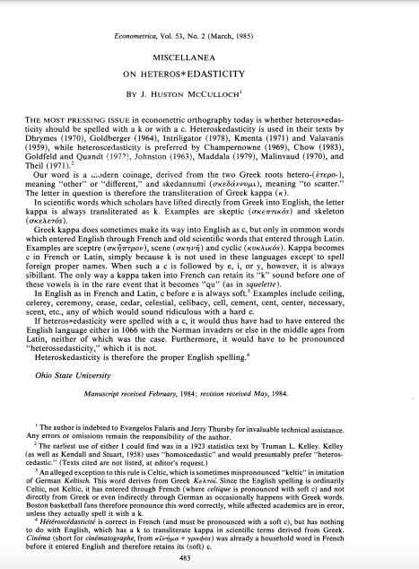
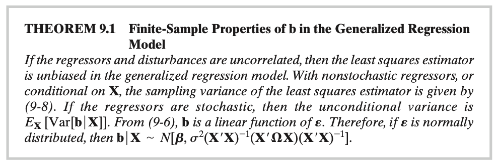
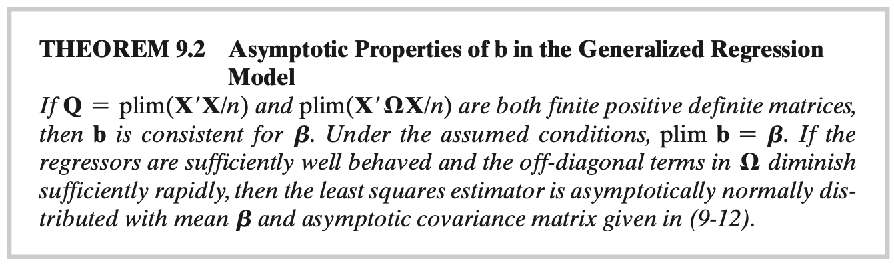
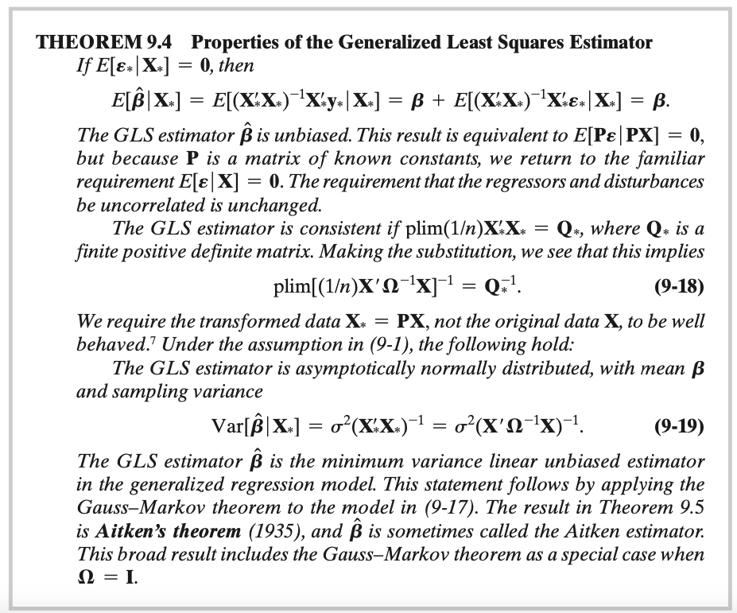

# Econometrics

## Intro

We now extend the multiple regression model to incorporate disturbances that violate assumption A.4.

\vfill

But first things first: is the correct name heteros*k*edasticity or heteros*c*edasticity?

\vfill

### Introduction

### Introduction

The **Generalized Linear Regression Model** is

$$\begin{split}
\mathbf{y} & =  \mathbf{X\beta}+\varepsilon \\
E[\mathbf{\varepsilon}|\mathbf{X}] & =  \mathbf{0} \\
E[\mathbf{\varepsilon\varepsilon'}|\mathbf{X}] & = \sigma^2\mathbf{\Omega}=\mathbf{\Sigma} \\ \end{split}$$

where $\Omega$ is a positive definite matrix.

\vfill

Notice that $\sigma^2\mathbf{I}$ is a special case.

\vfill

### Introduction

The two leading cases are **heteroskedasticity** and **autocorrelation**.

\vfill

Heteroskedasticity in cross-sectional data appear in data where the scale of the dependent variable and the explanatory power of the model tend to vary across observations.

  - For example, we observe greater variation in expenditure on certain commodity groups among high-income family than in low-income ones.

\vfill

Let's focus on this issue now, still assuming that disturbances are uncorrelated across observations.

\vfill

### Introduction

In the current context, $\sigma^2\mathbf{\Omega}$ would be

$$\sigma^2\mathbf{\Omega}=\sigma^2 \begin{bmatrix}
\omega_1 & 0 & \cdots & 0 \\
0 & \omega_2 & \cdots & 0 \\
\vdots & \vdots & \ddots & \vdots \\
0 & 0 & \cdots  & \omega_n \end{bmatrix}=\begin{bmatrix}
\sigma_1^2 & 0 & \cdots & 0 \\
0 & \sigma_2^2 & \cdots & 0 \\
\vdots & \vdots & \ddots & \vdots \\
0 & 0 & \cdots  & \sigma_n^2 \end{bmatrix}$$

## Robust Least Squares Estimation and Inference

The generalized model drops assumption A.4., allowing disturbances to being heteroskedastic or autocorrelated (or both).

\vfill

The Least Squares estimator is said to be "robust" if it is insensitive to departures from the base assumptions of the model.

  
\vfill

We can distinguish between

  1. **Robust estimator**: A consistent estimator that remain consistent in spite of violations of assumpions used to motivate it.
  2. **Robust inference**: Inference procedures are robust when they are based on estimators of asymptotic variances that are appropriate even when the assumptions are violated.
  
\vfill

### A Heteroskedasticity-Robust Covariance Matrix for Least Squares

For the most general case, suppose $Var[\varepsilon_i|\mathbf{x}_i]=\sigma_i^2$

\vfill

We can write the LS estimator as

$$\mathbf{b}=\mathbf{\beta}+(\mathbf{X'X})^{-1}\sum_{i=1}^n{\mathbf{x}_i\varepsilon_i}$$

Then, $$Var[\mathbf{b}|\mathbf{X}]=\frac{1}{n}\left(\frac{\mathbf{X'X}}{n}\right)^{-1}\left(\frac{\mathbf{X'}(\sigma^2\mathbf{\Omega})\mathbf{X}}{n}\right)\left(\frac{\mathbf{X'X}}{n}\right)^{-1}$$

The asymptotic variance will be

$$Asy.Var[\mathbf{b}]=\frac{1}{n}\mathbf{Q}^{-1}\left[\text{plim }\frac{1}{n}\sum_{i=1}^n{\sigma_i^2\mathbf{x}_i\mathbf{x}_i'}\right]\mathbf{Q}^{-1}=\frac{1}{n}\mathbf{Q}^{-1}\mathbf{Q}^*\mathbf{Q}^{-1}$$

\vfill

### A Heteroskedasticity-Robust Covariance Matrix for Least Squares

Two points to consider:

  1. Is $s^2(\mathbf{X'X})^{-1}$ likely to be a valid estimator of $Asy.Var[\mathbf{b}]$?
  2. If not, is there a strategy available that is "robust" to unspecified heteroskedasticity?
  
\vfill

Based on the expression for $Var[\mathbf{b}|\mathbf{X}]$, we see that $s^2(\mathbf{X'X})^{-1}$ would not be the appropriate estimator for the asymptotic covariance matrix for the LS estimator.

\vfill

The answer to the second question is yes. What we need is a feasible estimator of $\mathbf{Q}^*$.

\vfill

### White's (1980) Heteroskedasticity-Robust Estimator

White's (1980) Heteroskedasticity-Robust Estimator of $\mathbf{Q}^*$ is

$$\mathbf{W}_{het}=\frac{1}{n}\sum_{i=1}^n{e_i^2\mathbf{x}_i\mathbf{x}_i'},$$

where $e_i$ is the LS residual, $y_i-\mathbf{x}_i'\mathbf{b}$.

\vfill

Thus, we have

$$Est.Asy.Var[\mathbf{b}]=n(\mathbf{X'X})^{-1}\mathbf{W}_{het}(\mathbf{X'X})^{-1}$$
The implication is that we can discard the homoskedasticity assumption in A.4. and recover appropriate standard errors.

\vfill

### Robustness to Clustering

Settings in which the sample data consists of groups of related observations are increasingly common:

  1. firms grouped by industries
  2. students in schools
  3. homes in neighborhoods
  
\vfill

Suppose that the sample consists of $C$ groups of observations, labeled $c=1, \ldots, C$. There are $N_c$ observations in group (or cluster) $c$, with $c\geq1$.
  
  - Thus, $\sum_c{n}$.
  
\vfill

### Robustness to Clustering

The regression model is

$$y_{i,c}=\mathbf{x}_{i,c}'\mathbf{\beta}+\varepsilon_{i,c}$$

\vfill

The LS estimator is

$$\mathbf{b}=\mathbf{\beta}+\left(\sum_{c=1}^C{\mathbf{X_c'X_c}} \right)^{-1} \left[\sum_{c=1}^C{\left(\sum_{i=1}^N{\mathbf{x}_i}_{i,c}\varepsilon_{i,c} \right) } \right]=\mathbf{\beta}+(\mathbf{X'X})^{-1}\left[\sum_{c=1}^C{\mathbf{X}_c'\mathbf{\varepsilon}_c} \right]$$

where $X_c$ is the $N_c\times K$ matrix of exogenous variables for cluster $c$ and $\mathbf{\varepsilon}_c$ is the vector of $N_c$ disturbances for the group.

\vfill

Here we assume that observations within a cluster are correlated but the clusters are independent.

\vfill

### Robustness to Clustering

The variance matrix of the OLS estimator which is robust to clustering is

$$Var[\mathbf{b}|\mathbf{X}]=(\mathbf{X'X})^{-1}\left[\sum_{c=1}^C{X_c \mathbf{\Omega}_cX_c'} \right](\mathbf{X'X})^{-1}$$

\vfill

The construction is essentially the same as in the White estimator, though the matrix $\mathbf{\Omega}_c$ is the matrix of variances and covariances for the full vector $\mathbf{\varepsilon}_c$. 

  - It would be identical to the White estimator if each cluster contained one observation. 
  
\vfill

The asymptotic covariance matrix is

$$Asy.Var[\mathbf{b}]=\frac{1}{n}\mathbf{Q}^{-1}\left[\text{plim }\sum_{c=1}^C{X_c \mathbf{\Omega}_cX_c'} \right]\mathbf{Q}^{-1}$$

\vfill

The practical issue is that the asymptotic result holds only as the number of clusters $C$ increses. In practice, $C$ is rather small.

\vfill

### Robustness to Clustering

Like before, we need a feasible estimator for the term in brackets. 

\vfill

We ca use

$$\mathbf{W}_{\text{cluster}}=\frac{1}{C}\sum_{c=1}^C{\left(\mathbf{X}_c'\mathbf{e}_c \right)\left(\mathbf{X}_c'\mathbf{e}_c \right)'}=\frac{1}{C}\sum_{c=1}^C{\left(\sum_{i=1}^{N_c}{\mathbf{x}_{ic}\mathbf{e}_{ic}} \right)\left(\sum_{i=1}^{N_c}{\mathbf{x}_{ic}\mathbf{e}_{ic}} \right)'}$$
\vfill

Then,

$$Est.Var.Asy[\mathbf{b}]=\mathbf{C}(\mathbf{X'X})^{-1}\mathbf{W}_{\text{cluster}}(\mathbf{X'X})^{-1}$$

### Bootstrapped Standard Errors with Clustered Data

The preceding discussion assumes that the sample consists of a reasonably large number of clusters, drawn randomly from a very large population of clusters.

\vfill

The method used to estimate the covariance matrix involves using the data in $\mathbf{X}$ and the LS residuals.

\vfill

**Bootstrapping** is another method that is likely to be effective under those assumed sampling conditions.

\vfill

### Bootstrapped Standard Errors with Clustered Data

The basic steps in the methodology are:

  1. For $R$ repetitions, draw a random sample of $N_c$ observations from the full sample of $N_c$ observations with **replacement**. Estimate the parameters of the regression model with each of the R constructed samples.
  2. The estimator of the asymptotic covariance matrix is the sample variance of the $R$ sets of estimated coefficients.
  
\vfill

### Robust Covariance Matrix Estimation

To sum up, covariance-robust estimators allow us to still make appropriate inferences based on the LS estimators without actually specifying the type of heteroskedasticity involved.

\vfill

Note: The asymptotic properties of the estimator are unambiguous, but the results in small samples can be problematic:

  - squared residuals tend to underestimate the squares of the true disturbances (we need to make adjustments in such cases).
  
## Properties of the Least Squares 

We now consider the generalized model outlined in the introduction: 

\vfill

$$\begin{split}
\mathbf{y} & =  \mathbf{X\beta}+\varepsilon \\
E[\mathbf{\varepsilon}|\mathbf{X}] & =  \mathbf{0} \\
E[\mathbf{\varepsilon\varepsilon'}|\mathbf{X}] & = \sigma^2\mathbf{\Omega}=\mathbf{\Sigma} \\ \end{split}$$

where $\Omega$ is a positive definite matrix.

\vfill

Here we aim to analyze which of the properties of the classical model still hold.

\vfill

### Finite sample Properties of the Least Squares

Under the generalized model, we have 

$$E[\mathbf{b}|\mathbf{X}]=\beta  \Rightarrow E[\mathbf{b}]=\mathbf{\beta}$$

and

$$Var[\mathbf{b}|\mathbf{X}]=\frac{1}{n}\left(\frac{\mathbf{X'X}}{n}\right)^{-1}\left(\frac{\mathbf{X'}(\sigma^2\mathbf{\Omega})\mathbf{X}}{n}\right)\left(\frac{\mathbf{X'X}}{n}\right)^{-1}$$

\vfill

Because the variance of the LS estimator is not $\sigma^2(\mathbf{X'X})^{-1}$, statistical inference based on $s^2(\mathbf{X'X})^{-1}$ may be misleading.

\vfill

### Finite sample Properties of the Least Squares

### Asymptotic Properties of the Least Squares

In the heteroskedastic case, if the variances of $\varepsilon_i$ are finite and are not dominated by a single term, so that the conditions of the Lindeberg-Feller CLT applies, then the LS estimator is asymptotically normally distributed with covariance matrix

$$Asy.Var[\mathbf{b}]=\frac{1}{n}\mathbf{Q}^{-1}\left[\text{plim }\frac{1}{n}\sum_{i=1}^n{\sigma_i^2\mathbf{x}_i\mathbf{x}_i'}\right]\mathbf{Q}^{-1}$$

\vfill

For the most general case, asymptotic normality is much more difficult to establish because we might not necessarily have sums of independent or even uncorrelated random variables. 

\vfill

Nonetheless, Amemiya (1985) and Anderson (1971) have established the asymptotic normality of $\mathbf{b}$ in a model of autocorrelated disturbances general enough to include most of the settings we are likely to meet in practice. 

\vfill

### Asymptotic Properties of the Least Squares

### Heteroskedasticity and $Var[\mathbf{b}|\mathbf{X}]$

We have that, for well-behaved regressors,

$$Asy.Var[\mathbf{b}|\mathbf{X}]=\frac{\sigma^2}{n}\mathbf{Q}^{-1}\left(\text{plim }\sum_{i=1}^n{\omega_i\mathbf{x}_i\mathbf{x}_i'} \right)\mathbf{Q}^{-1}$$

In general, we have 

$$\mathbf{b} \sim_a N[\mathbf{\beta}, \frac{\sigma^2}{n}\mathbf{Q}^{-1}\mathbf{Q}^*\mathbf{Q}^{-1}], \text{ with }  \mathbf{Q}^*=\text{plim }\sum_{i=1}^n{\omega_i\mathbf{x}_i\mathbf{x}_i'} $$

\vfill

The conventionally estimated covariance matrix for the LS estimator, however, is $\sigma^2 (\mathbf{X'X})^{-1}$, which is inappropriate.

\vfill

The appropriate matrix is $\sigma^2(\mathbf{X'X})^{-1}(\mathbf{X'\Omega X})(\mathbf{X'X})^{-1}$

\vfill

### Heteroskedasticity and $Var[\mathbf{b}|\mathbf{X}]$

We now consider how erroneous the conventional estimator is likely to be. The difference is

$$Est.Var[\mathbf{b}|\mathbf{X}]-Var[\mathbf{b}|\mathbf{X}]=s^2(\mathbf{X'X})^{-1}-\sigma^2(\mathbf{X'X})^{-1}(\mathbf{X'\Omega X})(\mathbf{X'X})^{-1}$$
In large samples, where $s^2 \approx \sigma^2$, the difference is approximately equal to

$$\mathbf{D}=\frac{\sigma^2}{n}\left(\frac{\mathbf{X'X}}{n}\right)^{-1}\left[\frac{\mathbf{X'X}}{n}- \frac{\mathbf{X'}\mathbf{\Omega}\mathbf{X}}{n}\right]\left(\frac{\mathbf{X'X}}{n}\right)^{-1}$$

### Heteroskedasticity and $Var[\mathbf{b}|\mathbf{X}]$

The difference between the two matrices hinges on the bracketed matrix,

$$\mathbf{\Delta}=\sum_{i=1}^n{(1/n)\mathbf{x}_i\mathbf{x}_i'}-\sum_{i=1}^n{(\omega_i/n)\mathbf{x}_i\mathbf{x}_i'}=\frac{1}{n}\sum_{i=1}^n{(1-\omega_i)\mathbf{x}_i\mathbf{x}_i'}$$

These are two weighted averages of the matrices $\mathbf{x}_i\mathbf{x}_i'$ using weights 1 for the first term and $\omega_i$ for the second.

\vfill

## Efficient Estimation by Generalized Least Squares (GLS)

Efficient estimation of $\mathbf{\beta}$ in the generalized regression model requires knowledge of $\mathbf{\Omega}$.

\vfill

Let's consider the case in which $\mathbf{\Omega}$ is a known, symmetric, positive definite matrix.

\vfill

Because $\mathbf{\Omega}$ is a positive definite symmetric matrix, if can be factored into

$$\mathbf{\Omega}=\mathbf{C\Lambda C'},$$

where the columns of $\mathbf{C}$ are the characteristic vectors of $\mathbf{\Omega}$ and the characteristic roots of $\mathbf{\Omega}$ are arrayed n the diagonal matrix $\Lambda$.

\vfill

### Generalized Least Squares (GLS)

Define $\mathbf{\Lambda}^{1/2}$ as the diagonal matrix with the $i$th diagonal element $\sqrt{\lambda_i}$ and let $\mathbf{T}=\mathbf{C\Lambda^{1/2}}$. Then,

$$\mathbf{TT'}=\mathbf{\Omega}$$

Also let $\mathbf{P}'=\mathbf{C\Lambda^{-1/2}}$, so $\mathbf{\Omega}^{-1}=\mathbf{P'P}$

\vfill

If we pre-multiply $\mathbf{y}=\mathbf{X\beta}+\mathbf{\varepsilon}$ by $\mathbf{P}$, we obtain

$$\mathbf{Py}=\mathbf{PX\beta}+\mathbf{P\varepsilon}$$
$$\mathbf{y_*}=\mathbf{X_*\beta}+\mathbf{\varepsilon_*}$$
\vfill

### Generalized Least Squares (GLS)

The conditional variance of $\mathbf{\varepsilon_*}$ is

$$E[\mathbf{\varepsilon_*}\mathbf{\varepsilon_*}'|\mathbf{X}]=E[\mathbf{P\varepsilon\varepsilon'P'}|\mathbf{PX}]=\mathbf{P}\sigma^2\mathbf{\Omega P'}=\sigma^2\mathbf{I}$$
so the classical regression model applies to the transformed model.

\vfill

Since it is assumed that $\mathbf{\Omega}$ is known, we can define

$$\begin{split} \hat{\mathbf{\beta}} & =  (\mathbf{X_*'X_*})^{-1}\mathbf{X_*}'\mathbf{y}_* \\
& = (\mathbf{X'P'PX})^{-1}\mathbf{X'P'Py}  \\
& = (\mathbf{X'\Omega^{-1}X})^{-1}\mathbf{X'\Omega^{-1}y}\end{split} $$

\vfill

### Generalized Least Squares (GLS)

We have that $\hat{\mathbf{\beta}}$ is the efficient estimator of $\mathbf{\beta}$ and it is called the Generalized Least Squares (GLS)

\vfill

This is in contrast to the OLS estimator, which uses $\mathbf{I}$ as the weighting matrix instead of $\mathbf{\Omega}^{-1}$.

\vfill

What can we say about the properties of the GLS estimator compared to the OLS?

\vfill

### Properties of the Generalized Least Squares

### Hypothesis Testing 

To test hypotheses, we can apply the full set of results we obtained before to this transformed model.

\vfill

Important to notice, however, that there is no precise counterpart to the $R^2$ in the generalized regression model.

\vfill

The GLS estimator minimizes the generalized sum of squares, $\varepsilon_*$. There is no assurance that dropping/adding variables would result in changes in the $R^2$ based on $\hat{\mathbf{\beta}}$.

\vfill

The transformed regression is a computational device, not the model of interest.

\vfill

### Feasible Generalized Least Squares

To use the results established above, $\mathbf{\Omega}$ must be known.

\vfill

If $\mathbf{\Omega}$ contains unknown parameters that need to be estimated, the GLS is not **feasible**.

\vfill

But with unrestricted $\mathbf{\Omega}$, there are far too many parameters to estimate with $n$ observations.

\vfill

The typical problem involves a small set of parameters $\pmb{\alpha}$ such that $\mathbf{\Omega}=\mathbf{\Omega}(\pmb{\alpha})$

\vfill

### Feasible Generalized Least Squares

A simple heteroskedasticity model would be

$$\sigma^2_i=\sigma^2 z_i^\theta$$
for some exogenous variable $z$.

Suppose that $\hat{\alpha}$ is a consistent estimator of $\alpha$. To make GLS feasible, we shall use $\hat{\mathbf{\Omega}}=\mathbf{\Omega}(\hat{\alpha})$

\vfill

The FGLS estimator is

$$\hat{\hat{\mathbf{\beta}}}= (\mathbf{X'\hat{\Omega}^{-1}X})^{-1}\mathbf{X'\hat{\Omega}^{-1}y}$$

Under some conditions, $\hat{\hat{\mathbf{\beta}}}$ is asymptotically equivalent to $\hat{\mathbf{\beta}}$ and the FGLS estimator based on $\hat{\alpha}$ has the same **asymptotic** properties as the GLS estimator.

\vfill

## Heteroskedasticity and the Weighted Least Squares

The GLS estimator is 

$$\hat{\mathbf{\beta}}=(\mathbf{X'\Omega^{-1}X})^{-1}\mathbf{X'\Omega^{-1}y}$$

Under Heteroskedasticity, $\mathbf{\Omega}^{-1}$ is a diagonal matrix whose $i$th diagonal element is $1/\omega_i$.

\vfill

The GLS estimator is obtained by regression

$$\mathbf{Py}=\begin{bmatrix}
y_1/\sqrt{\omega_1} \\
y_2/\sqrt{\omega_2} \\
\vdots \\
y_n/\sqrt{\omega_n} \\
\end{bmatrix} \text{ on  } \mathbf{PX}=\begin{bmatrix}
\mathbf{x}'_1/\sqrt{\omega_1} \\
\mathbf{x}'_2/\sqrt{\omega_2} \\
\vdots \\
\mathbf{x}'_n/\sqrt{\omega_n} \\
\end{bmatrix}$$

### Heteroskedasticity and the Weighted Least Squares

Applying OLS to the transformed model, we obtain the **weighted least squares** estimator (WLS)

$$\hat{\mathbf{\beta}}=\left[\sum_{i=1}^n{(1/\omega_i)\mathbf{x}_i\mathbf{x}_i'}\right]^{-1}\left[\sum_{i=1}^n{(1/\omega_i)\mathbf{x}_i\mathbf{y}_i} \right]$$

The logic of the computation is that observations with smaller variances receive a larger weight in the computations of the sums and therefore have greater influence in the estimates obtained.

\vfill

### Weighted Least Squares with *known* $\mathbf{\Omega}$

A common specification is that the variance is proportional to the one of the regressors or its square.

  - For example, in a regression of family expenditures, the relevant variable is usually income.
  
\vfill

If we assume $\sigma_i^2=\sigma^2x_{ik}^2,$ the transformed regression model for GLS is

$$\frac{\mathbf{y}}{\mathbf{x}_k}=\beta_k+\beta_1 \frac{\mathbf{x}_1}{\mathbf{x}_k}+\beta_2 \frac{\mathbf{x}_2}{\mathbf{x}_k}+\ldots++\beta_1 \frac{\mathbf{\varepsilon}}{\mathbf{x}_k}$$

\vfill
 
### Weighted Least Squares with *known* $\mathbf{\Omega}$

If we know the structure of the disturbances variance, we can recover efficiency by adjusting the data to incorporate this information.

\vfill

However, it is rarely possible to be certain about the nature of the heteroskedasticity in a regression model.

\vfill

Using the wrong set of weights has two important consequences:

  1. WLS becomes inefficient
  2. the standard errors will be incorrect
  
\vfill

The standard approach in the literature is to use OLS with the White estimator or some variant for the asymptotic covariance matrix.

\vfill

## Testing for Heteroskdasticity

Tests for heteroskedasticity will, in general, be applied to the OLS residuals (why?)

\vfill

The LS estimator of $\mathbf{\beta}$, in the presence of heteroskedasticity, although inefficient, is consistent.

\vfill

Thus, statistics computed using the LS residuals $e_i=(y_i-\mathbf{x}_i'\mathbf{b})$ will have the same asymptotic properties as those computed using the true disturbances $\mathbf{\varepsilon}=(y_i-\mathbf{x}_i'\mathbf{\beta})$.

\vfill

### White's General Test

White (1960) proposes a general hypothesis of the form

$$\begin{split}
H_0: & \sigma_i^2=E[\varepsilon_i^2|\mathbf{X}]=\sigma^2 \text{ for all } i \\
H_1: & \text{Not } H_0\end{split}$$

An approach is to use an $F$ test to test the hypothesis that $\gamma_1=0$ and $\gamma_2=0$ in the regression

$$e_i^2=\gamma_0 + \mathbf{X}_i'\mathbf{\gamma}_1+(\mathbf{x}_i\times \mathbf{x}_i')\mathbf{\gamma}_2+\nu_i$$

This test is extremely general. To carry it out, we need not make any specific assumptions about the nature of the heteroskedasticity.

\vfill

### The Breusch-Pagan Test

The Breusch-Pagan Test considers $E[\varepsilon^2|\mathbf{X}]$ to be a linear function of the explanatory variables:

$$E[\varepsilon^2|\mathbf{X}]=\delta_0 + \delta_1x_1+\ldots+\delta_kx_k+\nu$$
Therefore, the null hypothesis of homoskedasticity is

$$\begin{split}
H_0: & \delta_1=\delta_2=\ldots = \delta_k =0 \\
H_1: & \text{At least of } \delta_j \text{ is not equal to 0}\end{split}$$

Assuming the classical assumptions, $H_0$ can be tested using the usual $F$ test for the joint significance of all explanatory variables.

\vfill

Notice that we are relying on large sample properties since $\varepsilon^2 \geq 0$ cannot be normally distributed.

\vfill

### The Breusch-Pagan Test

The equation we estimate is 

$$e_i^2=\delta_0 + \delta_1x_{1i}+\ldots+\delta_kx_{ki}+\varepsilon'_i$$

The steps in performing the test are the following:

  1. Estimate $\mathbf{y}=\mathbf{x\beta}+\varepsilon$ and find $e$
  2. Estimate $\mathbf{e'e}=\mathbf{x\delta}+\varepsilon'$
  3. Perform the $F$ test for $\mathbf{\delta}=0$
  
  \vfill
  
  
