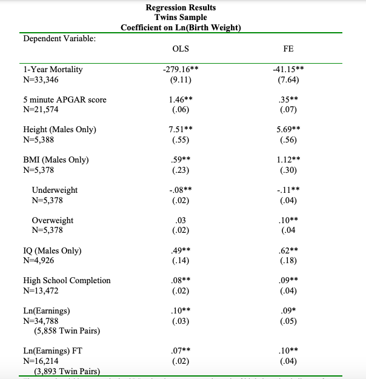
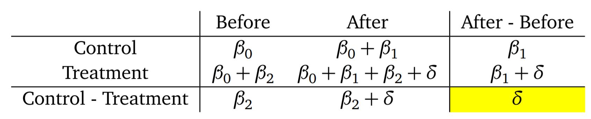
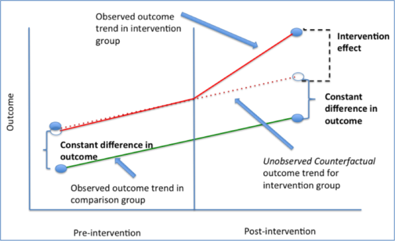
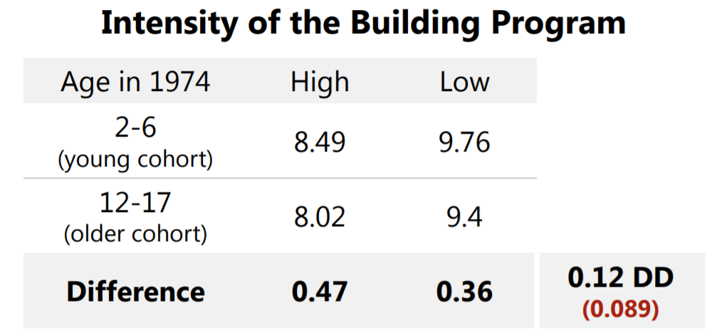
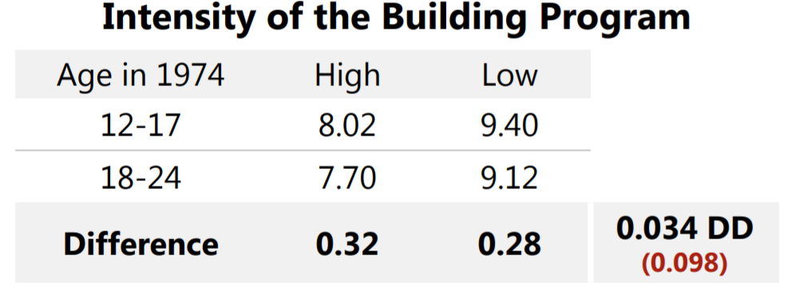
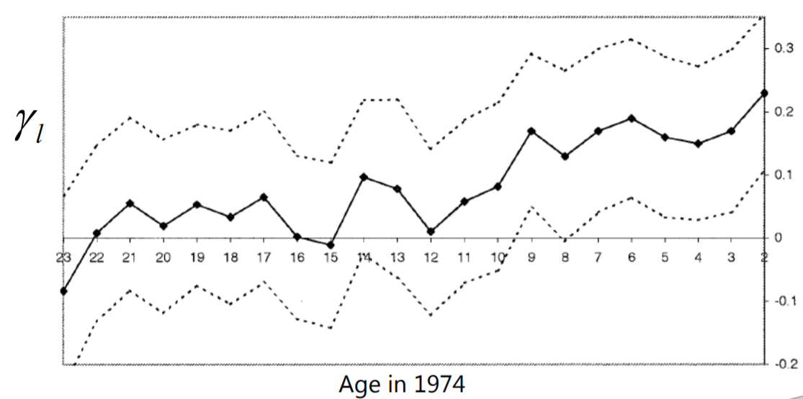
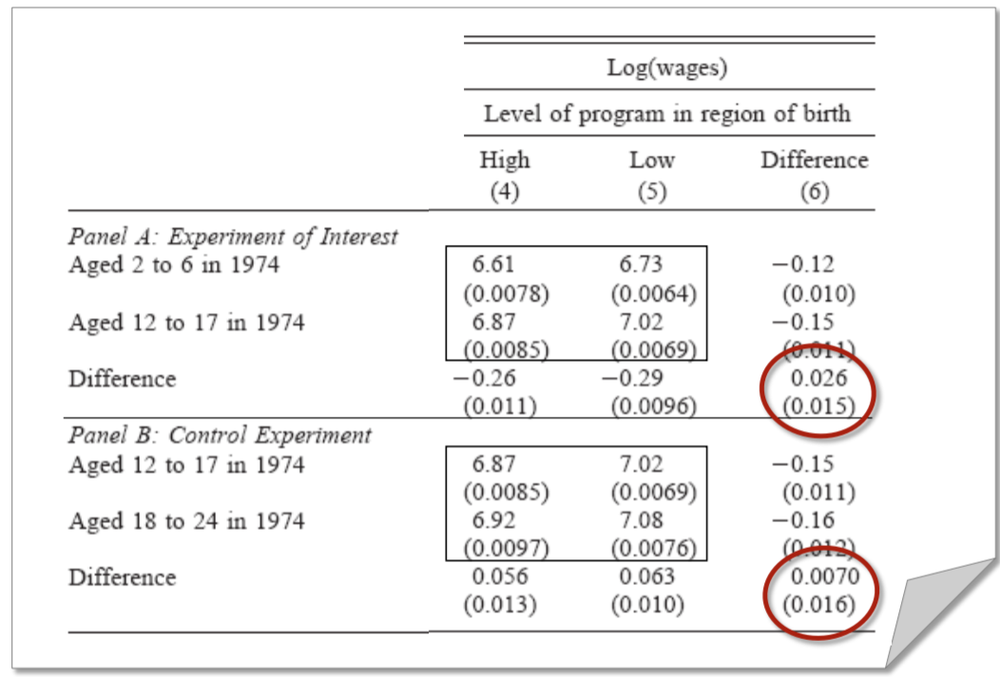

# Econometrics

## Intro

Here we will study models that deal with data sets that combine time series and cross sections: **panel data sets**.

\vfill

The analysis of panel data allows us to learn about the economic processes while accounting for both **heterogeneity** across units of observations and for the dynamic effects that are not visible in cross-secions.

\vfill

## Panel Data Modeling

Panel data models are more oriented toward cross-section analyses 
  
  - they are wide but typically short.
  
\vfill

Thus, in the typical panel, there are a large number of cross-sectional units and only a few periods.

\vfill

### The General Modeling Framework for Analyzing Panel Data

The basic framework is a regression model of the form

$$\begin{split} y_{it} = & \mathbf{x}_{it}'\pmb{\beta}+\mathbf{z}_i'\pmb{\alpha}+\varepsilon_{it}\\
 = & \mathbf{x}_{it}'\pmb{\beta}+ c_i+\varepsilon_{it} \end{split}$$
 
 There are $K$ regressors in $\mathbf{x}_{it}$, not including the constant term.
 
 
 \vfill
 
The heterogeneity, or individual effect, is $\mathbf{z}_i'\pmb{\alpha}$ where $\mathbf{z}_i$ contains a constant term and a set of individual or group-specific variables, which may be observed, such as race, sex, location, and so on; or unobserved, such as family specific characteristics, individual heterogeneity in skill or preferences, and so on, all of which are taken to be constant over time $t$.

\vfill

### The General Modeling Framework for Analyzing Panel Data

Notice that if all variables in $\mathbf{z}$ are observable, we could estimate the model above by OLS.

\vfill

The complication, however, arises when $c_i$ is **unobserved**.

\vfill

Our main objective here will be consistent and efficient estimation of the **partial effects**

$$\mathbf{\pmb{\beta}}=\partial E[y_{it}|\mathbf{x}_{it}]/\partial \mathbf{x}_{it} $$

\vfill

Whether this is possible depends on the assumptions about the unobserved (latent) effects.

\vfill

### The General Modeling Framework for Analyzing Panel Data

We can begin with a **strict exogeneity** assumption for the independent variables,

$$E[\varepsilon_{it}|\mathbf{x}_{i1},\mathbf{x}_{i2},\ldots,c_i]=E[\varepsilon_{it}|\mathbf{X}_i,c_i]=0$$

This implies that the current disturbance is uncorrelated with the independent variables in every period, past, present, and future.

\vfill

This assumption is sometimes unnecessarily strong but it is a convenient starting point and useful in some applications.

\vfill

### The General Modeling Framework for Analyzing Panel Data

A looser assumption of contemporaneous exogeneity is sometimes useful:

$$E[\varepsilon_{it}|\mathbf{x}_{it},c_i]=0$$

\vfill

The regression model with this assumption restricts influences of $\mathbf{x}$ on $E[\mathbf{y}|\mathbf{x}, c]$ to the
current period. 

\vfill

### The General Modeling Framework for Analyzing Panel Data

The crucial aspect of the model concerns the heterogeneity.

\vfill

A conventional assumption is the **mean independence**,

$$E[c_i|\mathbf{x}_{i1},\mathbf{x}_{i2},\ldots,]=\alpha$$
This assumption, which underlines the *random effects* model that we will discuss later, states that the unobserved variables are uncorrelated with the included variables.

\vfill

This is also a strong assumption and likely to be violated in many empirical applications.

\vfill

A weaker assumption would be that $E[c_i|\mathbf{x}_{i1},\mathbf{x}_{i2},\ldots,]=h(\mathbf{x}_{i1},\mathbf{x}_{i2},\ldots,)=h(\mathbf{X}_i)$ for some unspecified but nonconstant function of $\mathbf{X}_i$.

\vfill

### Model Structures

Panel data models can broadly be arranged as follows:

  1. **Pooled regression**: If $\mathbf{z}_i$ contains only a constant term, then the OLS estimator provides consistent and efficient estimates of the common $\alpha$ and slope vector $\pmb{\beta}$.
  2. **Fixed effects**: If $\mathbf{z}_i$ is unobserved, but correlated with $\mathbf{x}_{it}$, then the OLS estimator of $\pmb{\beta}$ is biased and inconsistent (why?). However, the model $$y_{it}=\mathbf{x}_{it}'\pmb{\beta}+ \alpha_i+\varepsilon_{it},$$ where $\alpha_i=\mathbf{z}_i'\alpha$ embodies all the observable effects and specifies an estimable conditional mean.

\vfill

### Model Structures

Panel data models can broadly be arranged as follows:

  3. **Random effects**: If the observed individual heterogeneity is uncorrelated with $\mathbf{x}_{it}$, the model may be formulated as
  
  $$\begin{split} y_{it} = & \mathbf{x}_{it}'\beta+E[\mathbf{z}_i'\alpha]+ \mathbf{z}_i'\alpha-E[\mathbf{z}_i'\alpha]+\varepsilon_{it}\\
   = & \mathbf{x}_{it}'\beta + \alpha + u_i + \varepsilon_{it}  \end{split}$$
   
  that is, a linear regression model with a compound disturbance that may consistently, albeit inefficiently, estimated by LS.

### Balanced and Unbalanced Panels 

As suggested by the preceding discussion, a panel data set consists of $n$ set of observations on individuals.

\vfill

If each individual is observed the same number of times $T$, the data set is a **balanced panel**.

\vfill

An **unbalanced panel** data set is one in which individuals may be observed different number of times.

  - In empirical applications, this might be due to **attrition**.
  
\vfill

A **fixed panel** is one in which the same set of individuals is observed for the duration of the study.

\vfill

A **rotating panel** is one in which the cast of individuals changes from one period to the next.

\vfill

### Well-Behaved Panel Data

Throughout the analysis we consider assumptions A.1. through A.4., as well as the asymptotic conditions on the matrices $\mathbf{X'X}/n$ and $(\mathbf{X}'\pmb{\varepsilon})/n$.

\vfill

Exceptions to the assumptions are likely to arise in a panel data set.
  
  - For example, the $\mathbf{x}_i$'s may be correlated across observations as they might be the same individual observed in multiple periods.
  
\vfill

### Well-Behaved Panel Data

The panel data set could be treated as follows:

  - Since the total number of rows in $\mathbf{X}$ is now $N=n\times T$, the matrix $\bar{\mathbf{Q}}_n$ is
  
  $$\bar{\mathbf{Q}}_n=\frac{1}{n}\sum_{i=1}^n{\frac{1}{T}\mathbf{X_i'X_i}}=\frac{1}{n}\sum_{i=1}^n{\mathbf{Q}_i}$$

\vfill

We then view the set of observations on the $i$th unit as if they were a single observation and apply our convergence arguments to the number of units increasing without bound.

\vfill

## The Pooled Regression Model

The simplest version of the model assumes

$$y_{it}= \alpha + \mathbf{x}_{it}'\beta+\varepsilon_{it}, i=1,\ldots,n; t=1,\ldots,T_i$$

$$E[\varepsilon_{it}|\mathbf{x}_{i1},\mathbf{x}_{i2},\ldots,\mathbf{x}_{iT_i}]=0$$

$$E[\varepsilon_{it}\varepsilon_{js}|\mathbf{x}_{i1},\mathbf{x}_{i2},\ldots,\mathbf{x}_{iT_i}]=\sigma_\varepsilon^2 \text{ if } i=j \text{ and } t=s \text{ and } = 0 \text{ if } i\neq j \text{ or } t\neq s  $$

\vfill

### Least Squares Estimation of the Pooled Model

In the form above, if the remaining assumptions of the classical model are met, then no further analysis is needed.

\vfill

OLS is the efficient estimator and inference can reliably proceed along the lines of the methods developed earlier in the course.

\vfill

The question, then, is what can be expected of the estimator when the heterogeneity does differ across individuals? 

\vfill

The fixed effects case is obvious: omitting (or ignoring) the heterogeneity when the fixed effects model is appropriate renders the least squares estimator inconsistent—sometimes wildly so. In the random effects case, the unobserved heterogeneity induces autocorrelation.

\vfill

### Robust Covariance Matrix 

Suppose we stack the $T_i$ observations for individual $i$ in a single equation

$$\mathbf{y}_i=\mathbf{x}_i\beta + \mathbf{w}_i$$

In a panel data set, although heteroskedasticity might be present, the more substantive effect is cross-observation correlation (or autocorrelation).

\vfill

The group of observations may all pertain to the same individual, so any latent effects left out of the model will carry across all periods. 

\vfill

Let's assume that the disturbances vector consists of $\varepsilon_{it}$ plus an omitted individual component. Then,

$$\begin{split}Var[\mathbf{w}_i|\mathbf{X}_i] = & \sigma_\varepsilon^2\mathbf{I}_{T_i}+\mathbf{\Sigma}_i\\
  = & \mathbf{\Omega}_i \end{split}$$
  
\vfill

### Robust Covariance Matrix 

The OLS estimator of $\mathbf{\beta}$ is 

$$\begin{split} \mathbf{b} = & (\mathbf{X'X})^{-1}\mathbf{X'y} \\
 = & \pmb{\beta} + \left[\sum_{i=1}^n{\mathbf{X_i'X_i}} \right]^{-1}\sum_{i=1}^n{\mathbf{X}_i'\mathbf{w}_i}  \end{split}$$
 
Consistency of $\mathbf{b}$ can be established as before.
 
\vfill

The true covariance matrix would take the form we saw for the GLS model

$$Asy.Var[\mathbf{b}]=\frac{1}{n}\text{plim }\left[\frac{1}{n} \sum_{i=1}^n{\mathbf{X_i'X_i}} \right]^{-1}\text{plim }\left[\sum_{i=1}^n{\mathbf{X}_i '\mathbf{\Omega}_i\mathbf{X}_i} \right]\text{plim }\left[\frac{1}{n} \sum_{i=1}^n{\mathbf{X_i'X_i}} \right]^{-1}$$

As before, the center matrix must be estimated.

\vfill

### Robust Covariance Matrix 

We can estimate $Asy.Var[\mathbf{b}]$ with

$$Est.Asy.Var[\mathbf{b}]=\frac{1}{n}\text{plim }\left[\frac{1}{n} \sum_{i=1}^n{\mathbf{X_i'X_i}} \right]^{-1}\text{plim }\left[\sum_{i=1}^n{\mathbf{X}_i '\mathbf{\hat{w}\hat{w}}_i'\mathbf{X}_i} \right]\text{plim }\left[\frac{1}{n} \sum_{i=1}^n{\mathbf{X_i'X_i}} \right]^{-1}$$

where $\mathbf{\hat{w}}_i$ is the vector of $T_i$ residuals for individual $i$.

\vfill

This construction is analogous to the "cluster"-robust estimator developed earlier.

\vfill

### Robust Estimation Using Group Means

The pooled regression model can also be estimated using the sample means of the data.

\vfill

Pre-multiplying the regression model by $(1/T)\mathbf{i}'$, where $\mathbf{i}'$ is a row vector of ones,

$$(1/T)\mathbf{i}'\mathbf{y}_i=(1/T)\mathbf{i'x_i}\pmb{\beta}+(1/T)\mathbf{i'w}_i$$

or 

$$\bar{y}_i=\mathbf{\bar{x}}_i'\pmb{\beta}+\bar{w}_i$$

Heteroskedastic variances are now $\sigma_i^2=(1/T^2)\mathbf{i}'\mathbf{\Omega_ii}$.

\vfill

### Robust Estimation Using Group Means

Consider, on the other hand, the general model

$$\mathbf{y}_i= \mathbf{x_i}\pmb{\beta}+c_i\mathbf{i}+\mathbf{w}_i,$$

where $c_i$ is the (latent) heterogeneous effect.

\vfill

If the mean independence assumption, $E[c_i|\mathbf{X}_i]=\alpha$ is not met, then the effect will be transmitted to the group means as well. 

\vfill

Averaging the observations in the group collects the entire set of effects, observed and latent, in the group means. Therefore, estimating $\pmb{\beta}$ by OLS will be both biased and inconsistent.

\vfill

### Estimator with First Differences

First differencing is another approach to estimation.

\vfill

Consider the model 

$$y_{it} = c_i+ \mathbf{x}_{it}'\pmb{\beta}+\varepsilon_{it}$$

which implies the first differences equation

$$\Delta y_{it} = \Delta c_i + (\Delta \mathbf{x}_{it})'\pmb{\beta} + \Delta \varepsilon_{it} $$

or 

$$\begin{split} \Delta y_{it} = &  (\Delta \mathbf{x}_{it})'\pmb{\beta} + \varepsilon_{it} - \varepsilon_{i,t-1}\\
 = & (\Delta \mathbf{x}_{it})'\pmb{\beta} + u_{it}
\end{split}$$

### Estimator with First Differences

The advantage of the first difference approach is that it removes the heterogeneity from the model.

\vfill

The disadvantage is that it removes all time-invariant variables from the model.

  -  If we have a panel data set and want to estimate the effects of schooling on wages, for example, we would not be able to employ this strategy, as years of education of workers are usually fixed in time.
  
\vfill

Note as well that the differencing procedure trades the cross-observation correlation in $c_i$ for a moving average (MA) disturbances $u_{it}=\varepsilon_{it} - \varepsilon_{i,t-1}$, which is autocorrelated.

\vfill

### The Within- and Between-Groups Estimator

Consider now three models we can consistently estimate by OLS:

$$\begin{split} \text{Pooled regression model: }  y_{it}  = & \alpha + \mathbf{x}_{it}\beta+\varepsilon_{it} \\ 
\text{Group means model: }  \bar{y}_i  = & \alpha +  \bar{\mathbf{x}}_{i}\beta+\bar{\varepsilon}_{i}\\
\text{Deviation from group means: } y_{it}-\bar{y}_i & =  (\mathbf{x}_{it}-\bar{\mathbf{x}}_{i})\beta+\varepsilon_{it} -\bar{\varepsilon}_{i}
\end{split}$$

For convenience, we write the last model as

$$\ddot{y}=\ddot{\mathbf{x}}_{it}'\pmb{\beta}+\ddot{\varepsilon}_{it}$$

\vfill

### The Within- and Between-Groups Estimator

Consider then the matrices of sums of squares and cross products that would be used in each case:

$$S_{xx}^{total}=\sum_{i=1}^n\sum_{t=1}^T{(\mathbf{x}_{it}-\bar{\bar{\mathbf{x}}})(\mathbf{x}_{it}-\bar{\bar{\mathbf{x}}})'} \text{ and } S_{xy}^{total}=\sum_{i=1}^n\sum_{t=1}^T{(\mathbf{x}_{it}-\bar{\bar{\mathbf{x}}})(\mathbf{y}_{it}-\bar{\bar{\mathbf{y}}})'}$$

where $\bar{\bar{\mathbf{x}}}$ and $\bar{\bar{\mathbf{y}}}$ are overall means.

\vfill

### The Within- and Between-Groups Estimator

$$S_{xx}^{between}=\sum_{i=1}^n{T(\bar{\mathbf{x}}_{i}-\bar{\bar{\mathbf{x}}})(\bar{\mathbf{x}}_{i}-\bar{\bar{\mathbf{x}}})'} \text{ and } S_{xy}^{between}=\sum_{i=1}^n{T(\bar{\mathbf{x}}_{i}-\bar{\bar{\mathbf{x}}})(\bar{\mathbf{y}}_{i}-\bar{\bar{\mathbf{y}}})'}$$

and

$$S_{xx}^{within}=\sum_{i=1}^n\sum_{t=1}^T{(\mathbf{x}_{it}-\bar{\mathbf{x}}_i)(\mathbf{x}_{it}-\bar{\mathbf{x}}_i)'} \text{ and } S_{xy}^{within}=\sum_{i=1}^n\sum_{t=1}^T{(\mathbf{x}_{it}-\bar{\mathbf{x}}_i)(\mathbf{y}_{it}-\bar{\mathbf{y}}_i)'}$$

\vfill

Notice that for this last sums, because the data are in deviations already, the means of $(\mathbf{x}_{it}-\bar{\mathbf{x}}_i)$ and $(\mathbf{y}_{it}-\bar{\mathbf{y}}_i)$ are zero.

\vfill

### The Within- and Between-Groups Estimator

Moreover, it can be shown that

$$S_{xx}^{total}=S_{xx}^{between}+S_{xx}^{within} \text{ and } S_{xy}^{total}=S_{xy}^{between}+S_{xy}^{within}$$

Therefore, there are three possible LS estimators of $\mathbf{\beta}$:

$$\mathbf{b}^{total}=[S_{xx}^{total}]^{-1}S_{xy}^{total}=[S_{xx}^{between}+S_{xx}^{within}]^{-1}[S_{xy}^{between}+S_{xy}^{within}]$$

$$\mathbf{b}^{between}=[S_{xx}^{between}]^{-1}S_{xy}^{between}$$

$$\mathbf{b}^{within}=[S_{xx}^{within}]^{-1}S_{xy}^{within}$$

\vfill

### The Within- and Between-Groups Estimator

From the preceding expressions, we have

$$S_{xy}^{between}=S_{xx}^{between}\mathbf{b}^{between} \text{ and } S_{xy}^{within}=S_{xx}^{within}\mathbf{b}^{within}$$

Inserting these expressions for $\mathbf{b}^{total}$,

$$\mathbf{b}^{total}=\mathbf{\mathbf{F}}^{within}\mathbf{b}^{within}+\mathbf{\mathbf{F}}^{between}\mathbf{b}^{between}$$

where $\mathbf{F}^{within}=[S_{xx}^{between}+S_{xx}^{within}]^{-1} S_{xx}^{within}=\mathbf{I}-\mathbf{F}^{between}$.

\vfill

We see that the LS estimator is a **matrix weighted average** of the within- and the between-groups estimators.

\vfill

## The Fixed Effects Model

Consider again the general model:

$$y_{it}  =  \alpha + \mathbf{x}_{it}'\pmb{\beta}+\varepsilon_{it}, i=1,\ldots,n; t=1,\ldots,T_i$$

$$\begin{split} E[\varepsilon_{it}|\mathbf{x}_{i1},\mathbf{x}_{i2},\ldots,\mathbf{x}_{iT_i}] = & 0 \\
E[\varepsilon_{it}\varepsilon_{js}|\mathbf{x}_{i1},\mathbf{x}_{i2},\ldots,\mathbf{x}_{iT_i}] = & \sigma_\varepsilon^2 \text{ if } i=j \text{ and } t=s \text{ and } = 0 \text{ if } i\neq j \text{ or } t\neq s \end{split}$$

In the fixed effects model, the omitted effects, $c_i$, can be arbitrarily correlated with the included variables.

\vfill

In a generic form,

$$E[c_i|\mathbf{x}_{i1},\mathbf{x}_{i2},\ldots,]=E[c_i|\mathbf{X}_i]=h(\mathbf{X}_i)$$

This is what signifies the fixed effects model, not that any variable is fixed in this context and random elsewhere, despite the terminology.

\vfill

### The Fixed Effects Model

Let's also assume that $Var[c_i|\mathbf{X}_i]$ is constant and all observations $c_i$ and $c_j$ are independent.

\vfill

The formulation implies that the heterogeneity across groups is captured in the constant term:

$$y_{it}=\alpha_i+ \mathbf{x}_{it}'\pmb{\beta}+\varepsilon_{it}$$

Each $\alpha_i$ can be treated as an unknown parameter to be estimated.

\vfill

### Least Squares Estimation

Let $\mathbf{y}_i$ and $\mathbf{X}_i$ denote the $T$ observations for the $i$th unit, let $\mathbf{i}$ be a $T\times 1$ column vector of ones, and let $\mathbf{\varepsilon}_i$ be the associated $T\times 1$ vector of disturbances.

\vfill

Then, 

$$\mathbf{y}_i=\mathbf{i}\alpha_i+ \mathbf{x}_{it}'\beta+\pmb{\varepsilon}_{i}$$

We can represent the model above as

$$\mathbf{y}_i=\mathbf{D}\pmb{\alpha}+ \mathbf{X}\pmb{\beta}+\pmb{\varepsilon}$$
where $D=[\mathbf{d}_1,\mathbf{d}_2,\ldots,\mathbf{d}_n]$, and $d_i$ is a dummy vector indicating the $i$th unit.

\vfill

This model is referred to as the **least squares dummy variable (LSDV) model**.

\vfill

### The LSDV Model

We can estimate this model by least squares, with $n+K$ parameters to be estimated.

\vfill

If $n$ is thousands, as it often is the case, then treating it as an ordinary regression will be extremely cumbersome.

\vfill

Fortunately, we can resort to the FWL theorem, reducing the size of the computation by a large amount.

\vfill

### The LSDV Model

We can write the LS estimator of $\mathbf{\beta}$ as

$$\mathbf{b}_{LSDV}=\left[\mathbf{X'M_DX}\right]^{-1}\left[\mathbf{X'M_Dy}\right]=\left[(\mathbf{X'M_D)(\mathbf{M_D}X})\right]^{-1}\left[(\mathbf{X'M_D)(\mathbf{M_D}y})\right]$$

where $\mathbf{M_D}=\mathbf{I}_{nT}-\mathbf{D}(\mathbf{D'D})^{-1}\mathbf{D}'$.

\vfill

This amounts to a LS regression using the transformed data $\mathbf{M_DX}$ and $\mathbf{M_Dy}$.

\vfill

It can be shown that $\mathbf{b}_{LSDV}=\mathbf{b}^{within}$.

\vfill

### The LSDV Model

In terms of the transformed data, then,

$$\begin{split}\mathbf{b}_{LSDV} & = \left[\sum_{i=1}^n{(\mathbf{M^0X_i})'(\mathbf{M^0X_i})} \right]^{-1}\left[\sum_{i=1}^n{(\mathbf{M^0X_i})'(\mathbf{M^0y_i})} \right] \\
& = \left[\sum_{i=1}^n{\ddot{\mathbf{X}}_i'\ddot{\mathbf{X}}_i} \right]^{-1}\left[\sum_{i=1}^n{\ddot{\mathbf{X}}_i'\ddot{\mathbf{y}}_i} \right] = (\ddot{\mathbf{X}}'\ddot{\mathbf{X}})^{-1}\ddot{\mathbf{X}}'\ddot{\mathbf{y}}\end{split}$$

We can recover the dummy variable coefficients from the other normal equation in the partition regression,

$$\mathbf{D'Da}+\mathbf{D'X}\mathbf{b}_{LSDV}=\mathbf{D'y} \text{ or } \mathbf{a}=[\mathbf{D'D}]^{-1}\mathbf{D}'(\mathbf{y}-\mathbf{D'X}\mathbf{b}_{LSDV})$$

\vfill

This implies that for each $i$,

$$a_i=\bar{\mathbf{y}}_i-\bar{\mathbf{x}}_i'\mathbf{b}_{LSDV}$$

\vfill

### The LSDV Model

The appropriate estimator for the asymptotic covariance matrix of $\mathbf{b}$ is

$$Est.Asy.Var[\mathbf{b}_{LSDV}]=s^2\left[\sum_{i=1}^n{\ddot{\mathbf{X}}_i'\ddot{\mathbf{X}}_i} \right]^{-1}$$

where 

$$s^2=\frac{(\ddot{\mathbf{y}}-\ddot{\mathbf{X}}\mathbf{b}_{LSDV})'(\ddot{\mathbf{y}}-\ddot{\mathbf{X}}\mathbf{b}_{LSDV})}{nT-n-K}$$

\vfill

### The LSDV Model

The $i$th residual in this computation is 

$$\begin{split} e_i & = y_{it}-\mathbf{x}_{it}'\mathbf{b}_{LSDV}-a_i=y_{it}-\mathbf{x}_{it}'\mathbf{b}_{LSDV}-(\bar{\mathbf{y}}_i-\bar{\mathbf{x}}_i'\mathbf{b}_{LSDV})\\
& = (y_{it}-\bar{\mathbf{y}}_i)- (\mathbf{x}_{it}-\bar{\mathbf{x}})'\mathbf{b}_{LSDV}\end{split}$$

Thus, the numerator in $s^2$ is exactly the sum of squared residuals using the LS slopes and the data in group mean deviation form.

\vfill

Also, we need to adjust the denominator to $nT-K$ instead of $nT-n-K$.

\vfill

### Fixed Time and Group Effects

The LSDV approach can be extended to include a time-specific effect as well.

\vfill

One way to formulate the extended model is simply to add the time effect, as in

$$y_{it}=\mathbf{x}_{it}'\mathbf{\beta}+\alpha_i + \delta_t + \varepsilon_{it}$$

This model simply includes an additional $T-1$ dummy variables to the model.

\vfill

### Fixed Time and Group Effects

An alternative extension would be the inclusion of a time trend and/or unit-specific linear time trends (linear trends that vary by unit):

$$y_{it}=\mathbf{x}_{it}'\mathbf{\beta}+t.\alpha_i + t + \varepsilon_{it}$$

\vfill

## Random Effects Model

The fixed effects model allows the unobserved individual effects to be correlated with the included variables.

\vfill

If the individual effects are uncorrelated with the regressors, then it might be appropriate to model the individual-specific constant terms as randomly distributed across cross-sectional units.

\vfill

Consider the reformulation of the model,

$$y_{it}=\mathbf{x}_{it}'\mathbf{\beta}+(\alpha + u_i) + \varepsilon_{it},$$
where there are $K$ regressors (including a constant) and now the single constant term is the mean of the unobserved heterogeneity, $E[\mathbf{z}_i'\alpha]$.

  - Recall that $u_i=[\mathbf{z}_i'\alpha-E(\mathbf{z}_i'\alpha)]$.

\vfill

### Random Effects Model

We continue to assume strict exogeneity:

$$\begin{split} E[\varepsilon_{it}|\mathbf{X}_i] = & E[u_{i}|\mathbf{X}_i]=0 \\
E[\varepsilon_{it}^2|\mathbf{X}_i] = & \sigma_\varepsilon^2 \\
E[u_{i}^2|\mathbf{X}_i] = & \sigma_u^2 \\
E[\varepsilon_{it}u_j|\mathbf{X}_i] = & 0 \text{ for all } i,t, \text{ and } j \\
E[\varepsilon_{it}\varepsilon_{js}|\mathbf{X}_i] = & 0 \text{ if } i\neq j \text{ or } t\neq s \\
E[u_i u_j|\mathbf{X}_i] = & 0 \text{ if } i\neq j \\
\end{split}$$

\vfill

### Random Effects Model

As before, let's also represent the model in blocks of $T$ observations for group $i$, $\mathbf{y}_i$, $\mathbf{X}_i$, $u_i$, and $\pmb{\varepsilon}_i$.

\vfill

For these $T$ observations, let

$$\eta_{it}=\varepsilon_{it}+u_i$$

and 

$$\pmb{\eta}_i=[\mathbf{\eta}_{i1},\mathbf{\eta}_{i2},\ldots,\mathbf{\eta}_{iT}]'$$

\vfill

In view of this form of $\eta_{it}$, we have what is often calld an **error components model**.

\vfill

### Random Effects Model

For this model,

$$\begin{split} E[\eta_{it}|\mathbf{X}_i]= & \sigma_\varepsilon^2+\sigma^2_u\\
E[\eta_{it}\eta_{js}|\mathbf{X}_i]= & \sigma^2_u, t\neq s\\
E[\eta_{it}\eta_{js}|\mathbf{X}_i]= & 0, \text{ for all } t \text{ and } s, \text{ if } i\neq j
\end{split}$$

For the $T$ observations for unit $i$, let $\mathbf{\Sigma}=E[\pmb{\eta}_{i}\pmb{\eta}_{i}'|\mathbf{X}_i]$

\vfill

### Random Effects Model

Then, 

$$\mathbf{\Sigma}=\begin{bmatrix} \sigma_\varepsilon^2+\sigma^2_u & \sigma^2_u & \sigma^2_u & \ldots & \sigma^2_u \\
\sigma^2_u & \sigma_\varepsilon^2+\sigma^2_u & \sigma^2_u & \ldots & \sigma^2_u \\
\vdots & \vdots & \vdots & \ddots & \vdots \\
\sigma^2_u & \sigma^2_u & \sigma^2_u & \ldots & \sigma_\varepsilon^2+\sigma^2_u
\end{bmatrix}=\sigma_\varepsilon^2\mathbf{I}_T+\sigma_u^2\mathbf{i}_T\mathbf{i}_T'$$

\vfill

### Random Effects Model

Because observations $i$ and $j$ are independent, the disturbance covariance matrix for the full $nT$ observations is 

$$\mathbf{\Omega}=\begin{bmatrix} \mathbf{\Sigma} & \mathbf{0} & \mathbf{0} & \ldots & \mathbf{0} \\
\mathbf{0} & \mathbf{\Sigma} & \mathbf{0} & \ldots & \mathbf{0} \\
\vdots & \vdots & \vdots & \ddots & \vdots \\
\mathbf{0} & \mathbf{0} & \mathbf{0} & \ldots & \mathbf{\Sigma}
\end{bmatrix}=\mathbf{I}_n \otimes \mathbf{\Sigma}$$

### The Least Squares Estimation

Consider again random effects the model:

$$y_{it}=\alpha + \mathbf{x}_{it}'\mathbf{\beta} + u_i + \varepsilon_{it},$$
with the strict exogeneity assumptions and the covariance matrix as detailed in the preceding discussion.

\vfill

Given that disturbances are correlated, because observations are correlated across time within a group (though not across groups), the generalized regression model above fits into the framework we developed in the previous chapter, the GLS model.

\vfill

### The Least Squares Estimation

Notice that we have also discussed four other methods that consistently estimates $\mathbf{\beta}$:

  1. OLS estimator
  2. the LSDV estimator
  3. First difference estimator
  4. Group means (between group) estimator
  
However, they are all inefficient! (why?)

\vfill

### Generalized Least Squares

The GLS estimator of the slope parameters is

$$\pmb{\hat{\beta}}= (\mathbf{X'\Omega^{-1}X})^{-1}\mathbf{X'\Omega^{-1}y}=  \left[\sum_{i=1}^n{\mathbf{X_i'\Sigma^{-1} X_i}} \right]^{-1}\left[\sum_{i=1}^n{\mathbf{X_i'\Sigma^{-1} y_i}} \right]$$

As before, to compute $\pmb{\hat{\beta}}$, w transform the data and use OLS with the transformed data.

\vfill

This requires $\pmb{\Omega}^{-1/2}=[\mathbf{I}_n \otimes \mathbf{\Sigma}]^{-1/2}=\mathbf{I}_n \otimes \mathbf{\Sigma}^{-1/2}$

\vfill

We have that 

$$\mathbf{\Sigma}^{-1/2}=\frac{1}{\sigma_\varepsilon}\left[\mathbf{I}_T - \frac{\theta}{T}\mathbf{i}_T \mathbf{i}_T' \right],$$

where $\theta=1-\frac{\sigma_\varepsilon}{\sqrt{\sigma^2_\varepsilon+T\sigma_u^2}}$.

\vfill

### Generalized Least Squares

The transformation of $\mathbf{y}_i$ and $\mathbf{X}_i$ for GLS is therefore, 

$$\mathbf{\Sigma}^{-1/2}\mathbf{y}_i=\frac{1}{\sigma_\varepsilon^2}\begin{bmatrix} y_{i1}-\theta \bar{\mathbf{y}}_i \\ 
y_{i2}-\theta \bar{\mathbf{y}}_i \\
\vdots \\
y_{iT}-\theta \bar{\mathbf{y}}_i
\end{bmatrix}$$

and likewise for the rows of $\mathbf{X}_i$.

\vfill

Notice that the LSDV model is the same as above, but using $\theta=1$.

\vfill

### Feasible Generalized Least Squares Estimation of the Random Effects Model when $\mathbf{\Sigma}$ is Unknown

If the variance components are known, GLS can be computed as shown earlier.

\vfill

Or course, this is unlikely, so as usual, we must first estimate the disturbance variances and then use a FGLS procedure.

\vfill

A heuristic approach to estimation of the variance components is as follows:

$$y_{it}=\alpha + \mathbf{x}_{it}'\mathbf{\beta} + u_i + \varepsilon_{it},$$

and

$$\bar{y}_{i}=\alpha + \bar{\mathbf{x}}_{i}'\mathbf{\beta} + u_i + \bar{\varepsilon}_{i}$$

Therefore, taking deviations from group means removes the heterogeneity.

\vfill

### Feasible Generalized Least Squares Estimation of the Random Effects Model when $\mathbf{\Sigma}$ is Unknown

We can, thus, estimate $\pmb{\beta}$ by the LSDV estimator, which is consistent and unbiased in most cases, and use its residuals, 

$$s^2_e(i)=\frac{\sum_{t=1}^{T}{(e_{it}-\bar{e}_i)^2}}{T-K-1}$$

Notice that $\bar{e}_i=0$ in the LSDV model.

\vfill

We have $n$ such estimators, so we average them to obtain

$$\bar{s}_e^2=\frac{1}{n}\sum_{i=1}^n{s^2_e(i)}=\frac{1}{n}\sum_{i=1}^n{\left[\frac{\sum_{t=1}^{T}{(e_{it}-\bar{e}_i)^2}}{T-K-1} \right]}=\frac{\sum_{i=1}^n\sum_{t=1}^{T}{(e_{it}-\bar{e}_i)^2}}{nT-nK-n}$$

### Feasible Generalized Least Squares Estimation of the Random Effects Model when $\mathbf{\Sigma}$ is Unknown

The degrees of freedom correction in $\bar{s}_e^2$ is excessive, because it assumes that $\alpha$ and $\beta$ are reestimated for each $i$.

\vfill

To account for that, we have 

$$\hat{\sigma}_\varepsilon^2=\frac{\sum_{i=1}^n\sum_{t=1}^{T}{(e_{it}-\bar{e}_i)^2}}{nT-n-K}=s^2_{LSDV}$$

\vfill

### Feasible Generalized Least Squares Estimation of the Random Effects Model when $\mathbf{\Sigma}$ is Unknown

It remanis to estimate $\sigma_u^2$.

\vfill

Returning to the original model,

$$y_{it}=\alpha + \mathbf{x}_{it}'\mathbf{\beta} + u_i + \varepsilon_{it},$$

If we estimate the above model using the pooled regression model, with only a single overall constant, we would find

$$\text{plim } s^2_{pooled} = \text{plim } \frac{\mathbf{e'e}}{nT-K-1}=\sigma_\varepsilon^2+\sigma_u^2 $$

because $\mathbf{b}_{pooled}$ is a consistent estimator of $\mathbf{\beta}$.

\vfill

Therefore, the estimator for $\sigma_u^2$ would be

$$\hat{\sigma}_u^2=s^2_{pooled}-s^2_{LSDV}$$

### Robust Inference and Feasible Generalized Least Squares

The GLS estimator is

$$\pmb{\hat{\beta}}= (\mathbf{X'\Omega^{-1}X})^{-1}\mathbf{X'\Omega^{-1}y}=  \left[\sum_{i=1}^n{\mathbf{X_i'\Sigma^{-1} X_i}} \right]^{-1}\left[\sum_{i=1}^n{\mathbf{X_i'\Sigma^{-1} y_i}} \right]$$

and the feasible GLS estimator is 

$$\hat{\hat{\pmb{\beta}}}=\pmb{\beta}+\left[\sum_{i=1}^n{\mathbf{X_i'\hat{\Sigma}^{-1} X_i}} \right]^{-1}\left[\sum_{i=1}^n{\mathbf{X_i'\hat{\Sigma}^{-1} \pmb{\varepsilon}}_i} \right]$$

Following the approach used in earlier applications, the estimated robust covariance matrix would be

$$\begin{split} Est.Asy.Var[b]=\left[\sum_{i=1}^n{\mathbf{X_i'\hat{\Sigma}^{-1} X_i}} \right]^{-1}\left[\sum_{i=1}^n{\left(\mathbf{X_i'\hat{\Sigma}^{-1} e}_i\right)\left(\mathbf{X_i'\hat{\Sigma}^{-1} e}_i\right)'} \right] & \\
\left[\sum_{i=1}^n{\mathbf{X_i'\hat{\Sigma}^{-1} X_i}} \right]^{-1} & \end{split}$$

## Hausman's Specification Test for the Random Effects Model

At various points, we have made the distinction between fixed and random effects models.
  
  - Which one should we use?

\vfill

The dummy variable approach is costly in terms of degrees of freedom lost.

\vfill

On the other hand, in the likely case of the individual effects being correlated with the other regressors, the random effects approach is **inconsistent**.

\vfill

The specification test devised by Hausman (1978) is used to test for the orthogonality of the common effects and the regressors.

\vfill

### Hausman's Specification Test for the Random Effects Model

The test is based on the idea that under the hypothesis of no correlation, both LSDV and FGLS estimators are consistent, but the LSDV is inefficient, whereas under the alternative, LSDV is consistent but FGLS is not.

\vfill

Under $H_0$, both $\mathbf{b}_{LSDV}$ and $\hat{\pmb{\beta}}_{pooled}$ are consistent, so the two estimates should not differ systematically.

\vfill

The chi-squared test based on the Wald criterion is

$$\mathbf{W}=\chi^2[K-1]=[\mathbf{b}_{LSDV}-\hat{\pmb{\beta}}_{pooled}]'[Var(\mathbf{b}_{LSDV}-\hat{\pmb{\beta}}_{pooled})]^{-1}[\mathbf{b}_{LSDV}-\hat{\pmb{\beta}}_{pooled}]$$

\vfill

Under the null hypothesis, $\mathbf{W}$ has a limiting chi-squared  distribution with $K-1$ degrees of freedom.

\vfill

### Hausman's Specification Test for the Random Effects Model

We need to find  $Var(\mathbf{b}_{LSDV}-\hat{\mathbf{\beta}}_{pooled})$. Hausman's essential result is that *the covariance of an efficient estimator with its difference from an inefficient estimator is zero*.

\vfill

Thus, we can show that $Var(\mathbf{b}_{LSDV}-\hat{\mathbf{\beta}}_{pooled})=Var(\mathbf{b}_{LSDV}) - Var(\hat{\mathbf{\beta}}_{pooled})$

### Hausman's Specification Test for the Random Effects Model

One drawback is that we cannot guarantee that the difference of the two covariance matrices will be positive definite in a finite sample.

\vfill

An asymptotically equivalent test statistic is

$$\mathbf{H}=(\mathbf{b}_{LSDV}-\mathbf{b}_{means})'[Asy.Var[\mathbf{b}_{LSDV}]+Asy.Var[\mathbf{b}_{means}]]^{-1}(\mathbf{b}_{LSDV}-\mathbf{b}_{means})$$

\vfill

## Applying the Fixed Effects Model

We can use fixed effects for other data structures to restrict comparisons to **within unit variation**.

\vfill

For example:

  1. Matched pairs (such as Twin fixed effects to control for unobserved effects of family background)
  2. Cluster fixed effects in hierarchical data (such as school fixed effects to control for unobserved effects of school)

\vfill

### Effects of Birth Endowments and Human Capital Accumulation - Twin Fixed Effects Approach

Is being born with better health good for subsequent human capital?

  - Facilitates learning
  - Better health increases education productivity 
  - Better education can affect labor market and welfare outcomes

\vfill

Black *et al* (2007) use twin individuals and estimate

$$y_{it} = \alpha + \beta health_{it}+ \gamma_j + \varepsilon_{it}$$

where $\gamma_j$ is the twin-fixed effects (FE). It absorbs all omitted factors that are common to twins born from the same mother.

\vfill

Identifying assumption: conditional on twin FE, the only relevant difference between twins is the birth health.

\vfill

### Results in Black et al (2007)

### Problems that Fixed Effects Do Not Solve

Consider the following regression model:

$$y_{it}=\mathbf{x}_{it}\mathbf{\beta}+c_i+\varepsilon_{it}$$
where $y_{it}$ is murder rate and $\mathbf{x}_{it}$ is police spending per capita

What happens when we regress y on x and city fixed effects?

  - $\hat{\mathbf{\beta}}_{FE}$ is inconsistent unless strict exogeneity conditional on $c_i$ holds
  - Implies $\varepsilon_{it}$ is uncorrelated with past, current and future regressors
  
\vfill

Most common violations:

  1. Time-varying omitted variables
  2. Simultaneity
  
\vfill

Fixed effects do not obviate need for good research design!

\vfill

### Fixed Effects and Differences-in-Differences

“Diff-in-Diff” is a common panel technique used for identification.

\vfill

In the basic setup, we have:

  - Two periods, $pre$ and $post$, where post period identified by the dummy variable, $Post_t$
  - Two groups, Treatment and Control, where the treatment group identified by the dummy variable, $Treat_i$ .

\vfill

### Fixed Effects and Differences-in-Differences

Diff-in-Diff Specification:

$$y_{it}=\beta_0+\beta_1Post_t + \beta_2 Treat_i + \delta Post_t \times Treat_i + \varepsilon_{it}$$

  - $\delta$ is the differences-in-differences"estimator.
  - It is also called an “average treatment effect”

\vfill

### Where does the term “diff-in-diff” come from?

“Diff-in-Diff” takes two differences:

  1. Pre vs Post
  2. Treatment vs Control
  
$$y_{it}=\beta_0+\beta_1Post_t + \beta_2 Treat_i + \delta Post_t \times Treat_i + \varepsilon_{it}$$

Write out predictions, their difference, then the difference in differences:

\vfill

### Where does the term “diff-in-diff” come from?

We have the “diff-in-diff” specification below:

$$y_{it}=\beta_0+\beta_1Post_t + \beta_2 Treat_i + \delta Post_t \times Treat_i + \varepsilon_{it}$$

\vfill

Treatment group might naturally differ from control: $\beta_2$

\vfill

Post might naturally differ from Pre: $\beta_1$

\vfill

Getting rid of both yields $\delta$, the average treatment effect

\vfill

### Diff-Diff Identifying Assumption 

The assumption for identification of the average treatment effect from $\delta$ is: *in the absence of a real treatment, control and treated units would have followed the same trends*.

\vfill

This assumption is called “**the common trends assumption**” or “**the parallel trends assumption**

\vfill

It is untestable by definition.

\vfill

An important implication is that treated and untreated units need no to be the same before policy adoption.

\vfill

### Diff-Diff Identifying Assumption 

### Threats to DID Assumptions

There are several reasons why the parallel assumption could fail:

  - Lack of parallel trends
  - Differential attrition in treated and untreated units, which may lead to compositional changes.

\vfill

It is impossible to test the common trends assumptions, but:

  - We can check pre-trends
  - If trends are similar before policy, then they would likely have continued to be similar in the post-period absent a real treatment.
  - Hence, it is important to have several periods before policy to really convince about the plausibility of the identifying assumption.
  
\vfill

### A More General DID Framework

In practice, we have more than two periods, although the treatment occurs after a given date.

\vfill

The identifying assumption could be valid conditional on certain variables

\vfill

It could be interesting to include both time and unit fixed effects.

\vfill

So, a more general Diff-in-Diff specification is:

$$y_{it}=\beta_0+\delta Post_t \times Treat_i + \beta_1 \mathbf{X}_{it} + \lambda_i + t_t + \varepsilon_{it}$$
where $\lambda_i$ are unit fixed effects and $t_t$ are time fixed effects.

\vfill

### Event-Study Specifications and Assumption in DID

How to check for pre-trends to convincingly evaluate the parallel trends assumption?

\vfill

Estimate the differences-in-differences for each period before and after policy adoption:

$$y_{it} = \beta_0 + \sum\delta_k^{pre}D_k^{pre}\times Treat_i + \sum\delta_k^{post}D_k^{post}\times Treat_i + \lambda_i + t_t + \varepsilon_{it}$$

If the identifying assumption is valid, then $\delta_k^{pre} = 0$ for all $k$ before policy adoption

\vfill

That is, the trends before policy are the same.

### Other Important Extensions in DID

Differences-in-Differences do not need to be *only* differences between units over time

\vfill

Interesting applications use differences within and between different groups. 

  - Examples: Differences between black and white in different states or countries
  
\vfill

There may be more comparison groups and implement differences-in-differences-in-differences:

  - Comparison between black and white in different states or countries before and after policy adoption
  
\vfill

###

Duflo (2001). *Schooling and Labor Market Consequences of School Construction in Indonesia: Evidence from an Unusual Policy Experiment.* **American Economic Review**

### Question and Motivation

More school infraestructure, more schooling?

\vfill

Educational level in turns affect wages?

\vfill

What is the economic return to education?

\vfill

### Program Description

1973-1978: The Indonesian government built 61,000 schools equivalent to one school per 500 children between 5 and 14 years old

\vfill

The enrollment rate increased from 69% to 85% between 1973 and 1978

\vfill

The number of schools built in each region depended on the number of children out of school in those regions in 1972, before the start of the program.

\vfill

### Treatment Effect Identification

There are 2 sources of variations in the intensity of the program for a given individual:

  1. **By region**: There is variation in the number of schools received in each region.
  2. **By age**: Children who were older than 12 years in 1972 did not benefit from the program, whereas the younger a child was 1972, the more it benefited from the program –- because she spent more time in the new schools.

\vfill
  
Sources of Data: 1995 population census. Individual-level data on:

  1. Birth date
  2. 1995 salary level
  3. 1995 educational level
  
\vfill

### A First Estimation of the Impact

**Step 1**: Simplify the intensity of the program and the groups of children affected by the program:

  - High or low areas with school construction
  - Young cohort of children who benefited/Older cohort of children who did not benefit

\vfill

### Look at the Average Years of Schooling

### Placebo or Falsification Test

Idea: Look for 2 groups whom you know did not benefit, compute a DID, and check whether the estimated effect is 0.

\vfill

### Formal Regression Results

**Step 2**: 

$$S_{ijk} =  c + \alpha_j + \beta_k + \gamma P_j \times T_i + C_j \times T_i + \varepsilon_{ijk}$$

where:

  - $S_{ijk}$ educational level of the person $i$ in region $j$ in cohort $k$
  - $P_j = 1$ if the person was born in a region with a high program intensity
  - $T_i = 1$ if the person belongs to the “young” cohort
  - $C_j$ dummy variable for region $j$
  - $\beta_k$ cohort fixed effects
  - $\alpha_j$ district of birth 
  
\vfill

The key **differences-in-differences parameter** is $\gamma$

\vfill

### Formal Regression Results

**Step 3**: We will use the intensity of the program in each region.

\vfill

We estimate the effect of the program for each cohort separately:

$$S_{ijk} =  c + \alpha_j + \beta_k + \sum_{i=2}^{23}{\gamma P_j \times d_i} + C_j \times T_i + \varepsilon_{ijk}$$

where $d_i$ a dummy variable for belonging to cohort $i$

\vfill

### Program Effect per Cohort

### Effects on Salary

### Conclusions

Results: For each school built per 1000 students;

  - The average educational achievement increase by 0.12-0.19 years
  - The average salaries increased by 2.6 – 5.4\%
  
Making sure the DD estimation is accurate:

  - A placebo DD gave 0 estimated effect
  - Use various alternative specifications
  - Check that the impact estimates for each age cohort make sense
  
\vfill
